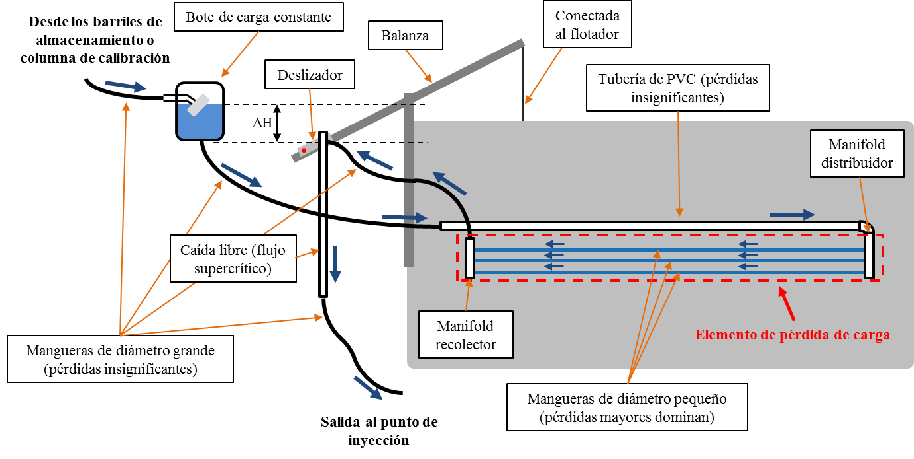
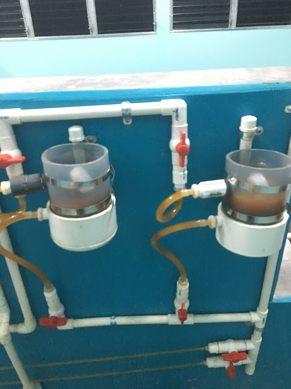
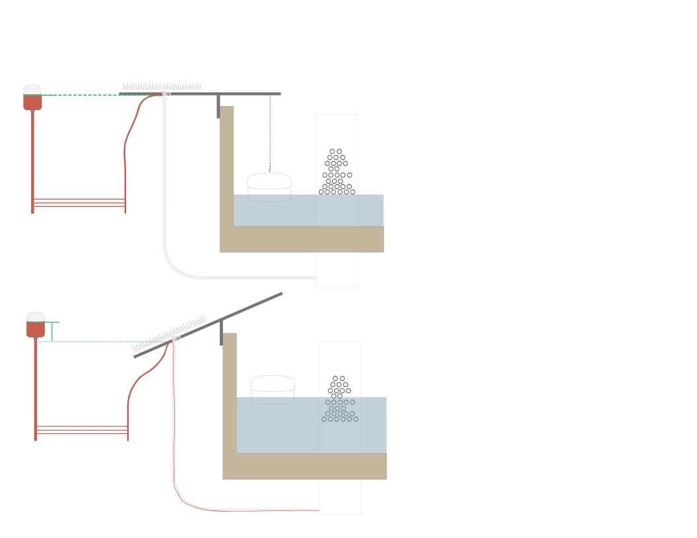
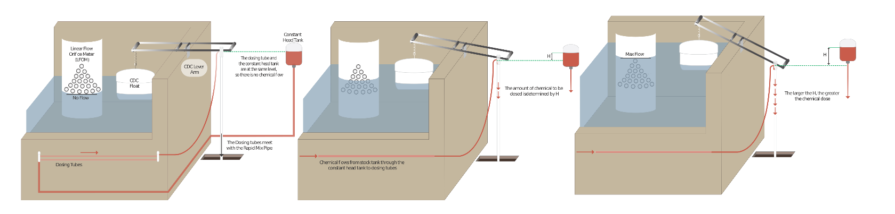

.. |C.CoagDoseMax| replace:: **PLACEHOLDER**
.. |C.ChlorDoseMax| replace:: **PLACEHOLDER**

.. _title_Dosing_Propósito_y_Descripción:

***********************
Propósito y Descripción
***********************
Los procesos de coagulación y desinfección requieren de la dosificación precisa de coagulante y de hipoclorito de calcio. Para realizar estos procesos sin bombas, la planta AguaClara utiliza un sistema de dosificación por gravedad.

.. _heading_componentes_principales:

Componentes principales
-----------------------
Los componentes principales del sistema son:

 - Dos tanques para almacenar la solución madre de cada químico (cuatro en total).
 - Una plataforma para elevar los tanques.
 - Dos botes de carga constante para cada químico (4 en total) que mantienen un reservorio a un nivel constante usando una válvula flotadora en la entrada.
 - Una balanza que conecta el nivel de agua en el tanque de entrada de la planta con el nivel de la salida del sistema de químicos.
 - Una serie de mangueras en el recorrido del químico del bote de carga constante a la balanza, que provee la relación necesaria entre la pérdida de carga y el caudal del químico.
 - Una columna de medición de caudal para cada químico.

Las flechas azules indican el recorrido del químico. La altura de la salida de la manguera en el deslizador controla el caudal del químico.

.. _figure_dosing_diagram:

    Esquema de un dosificador de AguaClara montado en la pared del tanque de entrada.

.. _heading_sistema_semi-automático:

Sistema semi-automático
-----------------------
Este sistema tiene las siguientes características:

 #. El flujo del químico se detiene automáticamente cuando no hay flujo de agua en la planta.
 #. Cambia el caudal de los químicos automáticamente en proporción al nivel de agua en el tanque de entrada, que es proporcional al caudal de la planta gracias al medidor lineal de caudal (sección anterior).

La primera provee seguridad contra una sobredosis y el derroche de químicos en el caso de que se para el flujo de agua en la planta sin que se detenga el flujo de químico manualmente. La segunda permite que un(a) operador(a) con experiencia elija la dosis del químico fácilmente, sin hacer ningún cálculo, y sin necesidad de manipular el sistema cada vez que cambia el caudal en la planta.

El sistema no es completamente automático porque requiere de un operador para elegir la dosis de cada químico y verificar que esa dosis se está aplicando.

.. _heading_bote_de_carga_constante:

Bote de carga constante
-----------------------
El bote de carga constante mantiene un nivel constante de fluido que define la altura de inicio del recorrido del químico. El nivel se mantiene con una válvula flotadora en la entrada de la botella.  Con el bote la altura del inicio del recorrido del químico es independiente de la cantidad de químico almacenada.

.. _figure_load_can:

    Bote de carga constante de sulfato de aluminio.

.. _heading_la_balanza:

La balanza
----------
Con el bote de carga constante definiendo la altura del inicio del recorrido y los tubos y mangueras que conducen el químico instalados permanentemente, el caudal del químico depende únicamente de la altura del final del recorrido. Este extremo del sistema está conectado a una balanza montada en la pared del tanque de entrada. Al otro lado de la balanza está conectado un flote sumergido en el tanque de entrada que inclina la balanza dependiendo del nivel de agua en el tanque (:numref:`figure_balance`), el cual depende del caudal de agua (:ref:`title_LFOM`).

.. _figure_balance:

    La balanza se inclina dependiendo del nivel de agua en el tanque de entrada.

El punto donde la manguera que conduce el químico a la balanza está montada en ella es un deslizador que puede correr a lo largo de la balanza. Se elige la dosis del químico manipulando la posición del deslizador, así cambiando la altura del final del recorrido (:numref:`figure_final_height`).

.. _figure_final_height:

    La altura final del recorrido del químico puede cambiar porque 1) cambia el caudal de agua en la planta o 2) se manipula la posición del deslizador para cambiar la dosis.

Cuando no hay flujo de agua en la planta la balanza está a nivel, de tal manera que la altura final del recorrido es igual al nivel de agua en el bote de carga constante. En esta situación el químico no fluye. Cuando sube el caudal en la planta, el flote hace que la balanza se incline más, bajando la altura de la manguera y aumentando el caudal del químico en proporción al caudal en la planta.

Para manipular la dosis de coagulante, el operador cambia la posición del deslizador en la balanza. Entre más bajo en la balanza inclinada se coloca este deslizador, mayor es el caudal del químico y la dosis correspondiente. En la posición más alta posible (marcado como 0% en la numeración) la salida de la manguera está a nivel del fluido en el bote de carga constante y el químico no fluye independientemente de la inclinación de la balanza. En la posición más baja posible (marcado como 100% en la numeración), se aplicará la dosis máxima (|C.CoagDoseMax| de coagulante o |C.ChlorDoseMax| de cloro para este diseño). Entre estos dos extremos la relación es lineal, de tal forma que el porcentaje indicado por la numeración en la balanza es el porcentaje de la dosis máxima que se aplica con la balanza en esa posición.

Al alcanzar el deslizador en la balanza, el químico cae libremente por un tubo de ½”, así aislando el recorrido a la balanza hidráulicamente. Para que la balanza pueda moverse libremente, este tubo está conectado con otra manguera flexible de diámetro grande bajo el piso de la planta. Esta manguera se conecta a la tubería que lleva el químico al punto de inyección.

.. _heading_small_hoses:

Mangueras de diámetro pequeño: elemento principal de pérdida de carga
---------------------------------------------------------------------
En el recorrido del bote de carga constante a la balanza, el químico pasa por una serie de mangueras de diámetro pequeño en paralelo. Casi toda la pérdida de carga a lo largo del recorrido del químico ocurre aquí. De esta manera, con el diseño de las mangueras se puede controlar la relación entre el caudal del químico y el cambio de altura del recorrido.

El flujo por las mangueras rectas hace que la pérdida de carga mayor domine, y que se mantengan mínimas las pérdidas menores (de expansiones). Esto es importante porque el dosificador cuenta con una relación lineal entre la altura del extremo del recorrido del químico (conectada al nivel de agua en el tanque de entrada) y el caudal del químico. Los sistemas con pérdidas mayores con flujo laminar proveen esta relación lineal mientras las pérdidas menores tienen una relación no lineal con el caudal.
