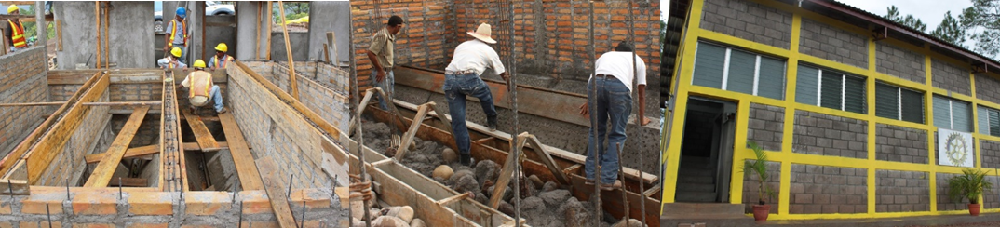

.. |T.SedWall| replace:: sed wall value
.. |T.SedDividingWall| replace:: sed dividing wall value
.. |T.SedChannelWall| replace:: sed channel wall value
.. |T.FlocWall| replace:: floc wall value
.. |T.FlocDividingWall| replace:: floc dividing wall value
.. |T.FiWall| replace:: fi wall value
.. |T.FiBoxWall| replace:: fi box wall value
.. |T.PlantWall| replace:: plant wall value
.. |T.DrainChannelWall| replace:: drain channel wall value
.. |T.FlocSlab| replace:: floc slab value
.. |T.ChemSlab| replace:: chem slab value
.. |T.PlantFloor| replace:: plant floor value

.. _title_Albañilería:

***********
Albañilería
***********
Todo lo que no es tubería en la planta en Honduras se ha construido de piedras, varillas, ladrillos, y concreto. Las paredes del tanque de entrada, el floculador, los tanques de sedimentación, y los filtros de arena han sido de ladrillo reforzado (:numref:`figure_plant_exterior`). La base de los tanques de sedimentación, incluyendo las tolvas inclinadas, ha sido de mampostería de piedras. En algunos casos las paredes exteriores del edificio se han construido de bloques de concreto, aunque este material no es adecuado para las paredes de los tanques por su permeabilidad.

.. _figure_plant_exterior:

    Los materiales comunes que se usan en la construcción de las plantas en Honduras: paredes de ladrillos reforzados, cimentaciones de piedras, y paredes exteriores de bloque.

Sin embargo, el diseño estructural de la planta es la responsabilidad del socio de implementación. El programa AguaClara de la Universidad de Cornell no pretende hacer recomendaciones acerca de los elementos estructurales del edificio; el diseño hidráulico simplemente da las dimensiones internas de cada recipiente, los diámetros de la tubería, las ubicaciones relativas de las instalaciones, y la orientación de cada una. Todo el trabajo de diseñar el edificio alrededor de las instalaciones hidráulicas de acuerdo con las normas técnicas del país del proyecto y los materiales disponibles le cae al socio. Es posible que en el futuro las mismas geometrías funcionales de la planta se construyan con distintos métodos y materiales. Ya que el diseño estructural influye en el diseño hidráulico, el usuario de la herramienta de diseño puede especificar el grosor de varias paredes y losas de la planta, con el fin de producir un diseño que corresponda a los materiales y métodos de construcción que en realidad se usarán. Por ejemplo, en Honduras se han construido paredes de ladrillo de aproximadamente 15cm de grosor para la mayoría de los tanques, pero en otros países es posible que haya que construir con concreto reforzado de otro grosor para cumplir con el reglamento nacional. Si los grosores de este diseño no corresponden al diseño estructural, siempre se puede pedir otro diseño de la herramienta para evitar cualquier conflicto entre el diseño estructural y el diseño hidráulico en el momento de construir. La siguiente tabla resume los grosores de los elementos estructurales para este diseño específico.

.. _table_element_thickness:

.. csv-table:: Grosores de algunos elementos estructurales
    :align: center

    "Pared exterior de los tanques de sedimentación", |T.SedWall|
    "Paredes que dividen los tanques de sedimentación adyacentes", |T.SedDividingWall|
    "Pared del canal de salida del tanque de sedimentación", |T.SedChannelWall|
    "Pared exterior del floculador", |T.FlocWall|
    "Paredes que dividen los canales adyacentes del floculador", |T.FlocDividingWall|
    "Paredes de los filtros de arena", |T.FiWall|
    "Paredes de las cajas auxiliares de los filtros de arena", |T.FiBoxWall|
    "Paredes exteriores del edificio", |T.PlantWall|
    "Paredes del canal de limpieza", |T.DrainChannelWall|
    "Losa del floculador", |T.FlocSlab|
    "Losa de la plataforma de químicos", |T.ChemSlab|
    "Losa del piso de la planta", |T.PlantFloor|
