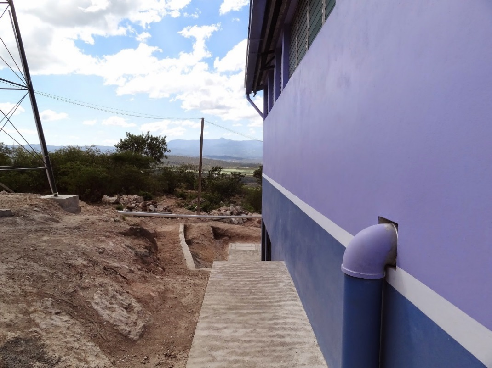

.. |H.Fi| replace:: H.Fi value
.. |ND.FiTrunk| replace:: Fi Trunk superior value
.. |ND.FiBwTrunk| replace:: Fi Bw Trunk inferior value
.. |PS.FiTrunkStr| replace:: Fi Trunk Str value
.. |ND.FiManBranch| replace:: Fi Man Branch superior value
.. |ND.FiBwManBranch| replace:: Fi Bw Man Branch inferior value
.. |PS.FiBranchStr| replace:: Fi Branch Str value
.. |ND.FiBranchHolder| replace:: Fi Branch Holder value
.. |PS.FiBranchHolderStr| replace:: Fi Branch Holder Str value
.. |ND.FlocObs| replace:: Floc Obs value
.. |PS.FlocObsStr| replace:: Floc Obs Str value

.. _title_Tubería:

*******
Tubería
*******
La planta AguaClara utiliza tubería y accesorios de PVC para toda la fontanería
con la excepción de:

#. La tubería de entrada, salida, y drenaje que está expuesta fuera del edificio (:numref:`figure_moroceli`). Aquí se usan tubos y accesorios de hierro galvanizado por su durabilidad.
#. Algunas conexiones de los sistemas de dosificación de químicos, que tienen que ser flexibles (:ref:`title_Dosing_Propósito_y_Descripción`). Se usan mangueras de varios tamaños.

En la planta no existen altas presiones estáticas, pues la mayor se produce en la parte inferior del filtro, que tiene |H.Fi| de profundidad, y no pasa de los 7 psi. La tubería de drenaje más delgada podría aguantar la presión en cualquier punto de la planta, y por tanto las especificaciones de los tubos no están basadas en las presiones sino en la durabilidad general y otras consideraciones prácticas.

.. _figure_moroceli:

    La tubería entrada de hierro galvanizado de la planta AguaClara de Morocelí, El Paraíso.

Se ha observado que los tubos de diámetro pequeño y paredes delgadas se deforman bajo el peso de los materiales que están encima al fundirlos en las paredes de ladrillo que se construyen en la planta, provocando fugas de agua. Además, hay más probabilidad de romper los que están expuestos durante la operación normal. Con los tubos de mayor diámetro las especificaciones de drenaje tienen paredes lo suficiente gruesas para no deformarse al fundirlos y aguantar el abuso normal de la operación. Como regla general, se recomiendan las especificaciones de la tubería de la planta en base a la siguiente guía:

.. _table_general_guide:

.. csv-table:: Guía general para las especificaciones de tubería dentro de la planta
    :header: "Diámetro de tubería de PVC", "Especificación"
    :align: center

    "1/2''", "SDR 13.5"
    "3/4''", "SDR 17"
    "1''-4''", "SDR 26"
    ">4''", "SDR 41"

La siguiente tabla resume algunos casos en que se recomiendo a veces una especificación diferente de la guía general:

.. _table_guide_exceptions:

.. csv-table:: Excepciones a la guía general para las especificaciones de tubería
    :header: "Descripción", "Diámetro nominal", "Especificación", "Justificación"
    :align: center

    "Líneas troncales de los manifolds del filtro", |ND.FiTrunk| (superior) – |ND.FiBwTrunk| (inferior), |PS.FiTrunkStr|, "El grosor hace más segura la conexión especial que se hace con los ramales."
    "Ramales de los manifolds del filtro", |ND.FiManBranch| (superior) – |ND.FiBwManBranch| (inferior), |PS.FiBranchStr|, "El grosor es necesario para la fabricación de las ranuras finas."
    "Receptores de los ramales de los manifolds del filtro", |ND.FiBranchHolder|, |PS.FiBranchHolderStr|, "El grosor hace más segura la conexión especial que se hace con los ramales. La durabilidad también facilita el trabajo de instalación."
    "Obstáculos del floculador", |ND.FlocObs|, |PS.FlocObsStr|, "La rigidez no es necesaria aquí aunque se usen tubos de diámetro menor de 6”."
    "Cualquier pistón de PVC que se usa para tapar un desagüe", "-", "SDR 41", "Para facilitar la operación de los desagües es mejor que los pistones sean livianos."
