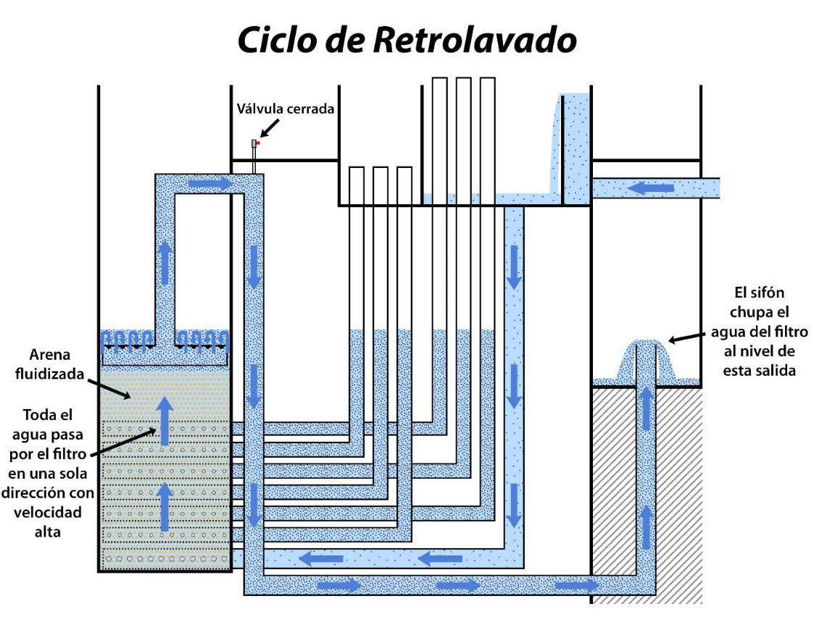

.. |HL.FiSiphonMax| replace:: **PLACEHOLDER**
.. |N.FiSiphonManOrifices| replace:: **PLACEHOLDER**
.. |Q.Fi| replace:: **PLACEHOLDER**
.. |Pi.VCOrifice| replace:: **PLACEHOLDER**
.. |ND.FiSiphon| replace:: **PLACEHOLDER**
.. |PS.FiSiphonStr| replace:: **PLACEHOLDER**
.. |ND.FiSiphonAirValve| replace:: **PLACEHOLDER**
.. |B.FiSiphonManOrifices| replace:: **PLACEHOLDER**
.. |D.FiSiphonManOrifices| replace:: **PLACEHOLDER**

.. _title_Sifón_del_Retrolavado:

*********************
Sifón del Retrolavado
*********************

Se controla el ciclo de retrolavado del FRAMCA utilizando un sifón que cambia el nivel de la salida del filtro, según el dibujo abajo. Cuando el sifón está activo, el agua pasa por él al desagüe en el canal de limpieza de la planta, a una altura mucho más baja que las cajas de entrada y salida. Este cambio de nivel es necesario con la gran pérdida de carga durante el ciclo de retrolavado. Por otro lado, cuando el sifón está roto el aire impide el flujo de agua, y por fuerza el agua tiene que salir en la caja de salida a una altura mucho más alta que corresponde a la pérdida de carga menor durante el ciclo de filtración. La ventaja del sifón es que se evita el uso de una válvula grande que se necesitaría para cambiar entre las dos salidas de otra forma.

.. _figure_backwash_cycle:

    El FRAMCA de AguaClara en el ciclo de retrolavado.

El diámetro de la tubería del sifón se define para que las pérdidas de carga a través de ella no superen de :math:`HL_{M \acute a x}` = |HL.FiSiphonMax|. Estas pérdidas de carga incluyen:

.. math::
    :label: head_loss_max_inequality

    HL_{Sif \acute o n}=HL_{Entrada}+HL_{Tuber \acute i a} + HL_{Salida} \leq HL_{M\acute a x}

| Donde
| :math:`HL_{Entrada}` = la pérdida de carga por la entrada del flujo en los orificios del sifón
| :math:`HL_{Tuber \acute i a}` = la pérdida de carga por la tubería y los accesorios en el corrido del sifón
| :math:`{HL}_{Salida}`` = la pérdida de carga por la salida del sifón en el canal de limpieza
| :math:`HL_{M\acute a x}` = la pérdida de carga máxima permisible por todo el sifón = |HL.FiSiphonMax|

Durante el retrolavado, el flujo entra en el sifón por unos orificios cuya área colectiva es aproximadamente igual al área transversal de la tubería.

.. math::
    :label: siphon_diameter

    D_{Orificio}=CeilNearest\left(\frac {ID_{Sif\acute on}}{\sqrt {N_{Orificios}}},D_{Broca}\right)

| Donde
| :math:`CeilNearest\left(x,M\right)` = una función para el valor en la matriz :math:`M` más cercana y mayor que el objetivo :math:`x`
| :math:`ID_{Sif \acute on}` = el diámetro interior de la tubería del sifón
| :math:`N_{Orificios}` = el número de orificios de salida, definido según el espacio disponible = |N.FiSiphonManOrifices|
| :math:`D_{Broca}` = la matriz de los diámetros de las brocas comúnmente disponibles

La salida del sifón en el canal de limpieza es la boca del tubo, la cual se aproxima como vertedero. La pérdida de carga por la salida entonces es:

.. math::
    :label: output_head_loss

    {HL}_{Salida}=\left(\frac{3}{2}\frac{Q}{\Pi_{VC}\sqrt{2g}\left(\pi{ID}_{Sif\acute on}\right)}\right)^{2/3}

| Donde
| :math:`Q` = el caudal del retrolavado, igual al caudal por filtro = |Q.Fi|
| :math:`\Pi _{VC}` = el coeficiente de vena contracta para un orificio = |Pi.VCOrifice|
| :math:`ID_{Sif \acute on}` = el diámetro interior de la tubería del sifón

.. _table_siphon_data:

.. csv-table:: Datos del sifón
    :align: center

    Tubo principal, |ND.FiSiphon| |PS.FiSiphonStr|
    Diámetro de la válvula de aire, |ND.FiSiphonAirValve|
    Número de agujeros en el manifold de salida, |N.FiSiphonManOrifices|
    Separación entre agujeros del manifold (centro a centro), |B.FiSiphonManOrifices|
    Diámetro de los agujeros del manifold, |D.FiSiphonManOrifices|
