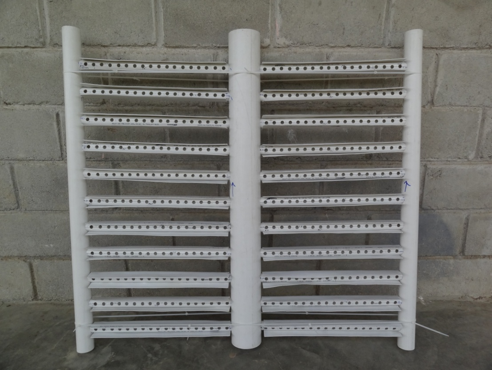

.. include:: ../global.rst

.. _title_Manifolds_de_Entrada:

********************
Manifolds de Entrada
********************

El agua sedimentada entra en el lecho de arena a cuatro niveles. Cada entrada cuenta con un manifold que distribuye el agua en esa capa. La asamblea consiste en un tronco que se instala en el centro del filtro con dos “alas” de tubos perforados de menor diámetro (:numref:`figure_entry_manifold`).

.. _figure_entry_manifold:

    El manifold consiste en un tronco con dos “alas” de tubos perforados. Hay tubos de |ND.FiBranchHolder| que reciben los tubos perforados en los lados de la caja.

Los objetivos en el diseño de los manifolds de entrada son:

 #. Lograr una distribución uniforme de agua en la capa de arena.
 #. Evitar que la arena entre en los tubos.
 #. Facilitar su fabricación e instalación.

Una restricción sobre la distribución del flujo por todas partes del lecho de arena gobierna la estimación del área colectiva de los orificios en los manifolds de entrada (véase :ref:`title_Distribución_del_Flujo`):

.. math::
    :label: flow_restriction

    A_{Est}=\frac{Q_{Fi}}{\Pi_{VC}\sqrt{2g\frac{{PR}_{Re}}{\left(1-{\Pi_Q}^2\right)}}}

| Donde
| :math:`A_{Est}` = el área colectiva estimada de los orificios en el manifold de retrolavado = |A.FiBwManOrificesEst|
| :math:`Q _{Fi}` = el caudal por filtro = |Q.Fi|
| :math:`\Pi _{VC}` = el coeficiente de vena contracta para un orificio = |Pi.VCOrifice|
| :math:`{PR}_{Re}` = la recuperación de presión total en el manifold de retrolavado = |PR.FiBwManTotal|
| :math:`\Pi _Q` = el radio mínimo del flujo por el camino largo sobre el flujo por el camino corto = |Pi.FiManifoldQ|

Con esta estimación del área colectiva, se puede definir el diámetro de los orificios tomando en cuenta los tamaños de las brocas comúnmente disponibles:

.. math::
    :label: diameter_bits

    D_{Orificio} = CeilNearest\left(\sqrt{\frac{4}{\pi}\frac{A_{Est}}{{L_{Ramal}}/{S_{Orificio}}}},D_{Broca}\right)

| Donde
| :math:`CeilNearest\left(x,M\right)` = una función para el valor en la matriz :math:`M` más cercana y mayor que el objetivo :math:`x`
| :math:`L_{Ramal}` = el largo útil del ramal (depende del diámetro del tronco del manifold)
| :math:`S_{Orificio}` = la separación estimada entre los orificios = |B.FiManOrificeEst|
| :math:`D_{Broca}` = la matriz de los diámetros de las brocas comúnmente disponibles

Los manifolds de entrada en medio del filtro traen dos veces más agua que el inferior porque entregan agua a dos capas del filtro, entonces este cálculo se repite independientemente para los orificios de estos manifolds con el doble de esta área. El manifold de la entrada superior tiene la misma área colectiva que el manifold inferior, porque solo entrega agua a la capa superior de arena. Una vez definidos el diámetro y el número de orificios por ramal y por manifold, se puede volver a calcular el área colectiva verdadera de los orificios y la pérdida de carga verdadera a través de ellos durante la filtración normal:

.. math::
    :label: headloss_end

    {HL}_{Orificio}=\frac{\left(\frac{Q_{Capa}}{A_{Capa}\Pi_{VC}\varepsilon_{Arena}}\right)^2}{2g}

.. _table_lower_manifold_data:

.. csv-table:: Datos del manifold de entrada inferior (número 4)
    :align: center

    Línea troncal del manifold inferior, |ND.FiBwTrunk| |PS.FiTrunkStr|
    Ramales de entrada inferiores, |ND.FiBwManBranch| |PS.FiBranchStr|
    Tubos que reciben los ramales en cada extremo, |ND.FiBranchHolder| |PS.FiBranchHolderStr|
    Número de ramales en el manifold, |N.FiManBranch|
    Longitud de los ramales, |L.FiBwManBranch|
    Longitud de la parte del ramal que entra en los orificios del tronco y el tubo que recibe el ramal en el otro extremo, |L.FiManBranchExt|
    Número de agujeros en cada ramal, |N.FiBwManOrificesPerBranch|
    Separación entre agujeros de los ramales (centro a centro), |B.FiBwManOrifice|
    Diámetro de los agujeros de los ramales, |D.FiBwManOrifice|
    Pérdida de carga estimada a través de los orificios durante el retrolavado, |HL.FiBwManOrifice|
    Pérdida de carga estimada a través de los orificios durante la filtración, |HL.FiBwManOrificeForward|

.. _table_center_manifold_data:

.. csv-table:: Datos de los manifolds de entrada en el centro (números 2 y 3)
    :align: center

    Líneas troncales de los manifolds, |ND.FiTrunk| |PS.FiTrunkStr|
    Ramales de entrada superiores, |ND.FiManBranch| |PS.FiBranchStr|
    Tubos que reciben los ramales en cada extremo, |ND.FiBranchHolder| |PS.FiBranchHolderStr|
    Número de ramales en cada manifold de entrada, |N.FiManBranch|
    Longitud de los ramales, |L.FiManBranch|
    Longitud de la parte del ramal que entra en los orificios del tronco y el tubo que recibe el ramal en el otro extremo, |L.FiManBranchExt|
    Número de agujeros en cada ramal, |N.FiInletManOrificesPerBranch|
    Separación entre agujeros de los ramales (centro a centro), |B.FiInletManOrifice|
    Diámetro de los agujeros de los ramales, |D.FiInletManOrifice|
    Pérdida de carga estimada a través de los orificios durante la filtración, |HL.FiInletManOrificeForward|

.. _table_upper_manifold_data:

.. csv-table:: Datos del manifold de entrada superior (número 1)
    :align: center

    Línea troncal del manifold, |ND.FiTrunk| |PS.FiTrunkStr|
    Ramales de entrada superiores, |ND.FiManBranch| |PS.FiBranchStr|
    Tubos que reciben los ramales en cada extremo, |ND.FiBranchHolder| |PS.FiBranchHolderStr|
    Número de ramales en cada manifold de entrada, |N.FiManBranch|
    Longitud de los ramales, |L.FiManBranch|
    Longitud de la parte del ramal que entra en los orificios del tronco y el tubo que recibe el ramal en el otro extremo, |L.FiManBranchExt|
    Número de agujeros en cada ramal, |N.FiTopManOrificesPerBranch|
    Separación entre agujeros de los ramales (centro a centro), |B.FiTopManOrifice|
    Diámetro de los agujeros de los ramales, |D.FiTopManOrifice|
    Pérdida de carga estimada a través de los orificios durante la filtración, |HL.FiTopManOrificeForward|
