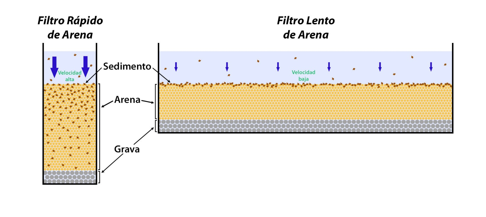
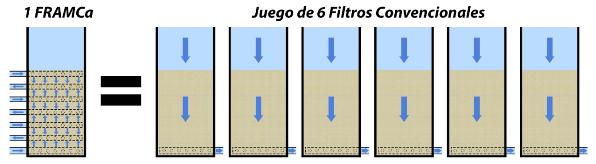
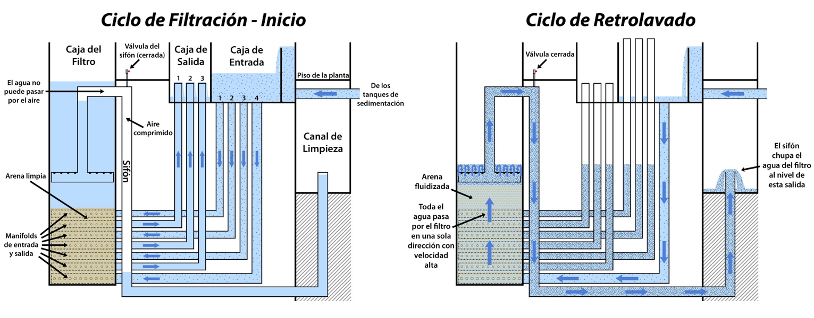
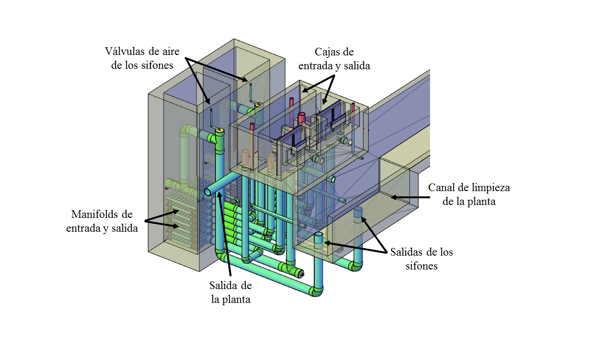

.. _title_Filt_Propósito_y_Descripción:

***********************
Propósito y Descripción
***********************

Como proceso final en la remoción de sólidos, este diseño utiliza filtración rápida con arena en la forma del FRAMCA (Filtro Rápido de Arena en Múltiples Capas) de AguaClara. La filtración rápida baja aún más la turbiedad del agua después de sedimentación, y elimina los microorganismos nocivos que son resistentes al cloro. El proceso consiste en pasar el agua sedimentada por un lecho de arena, con velocidad suficiente que las partículas puedan entrar en la arena y no colarse en la superficie.

.. _figure_filt_diagram_1:

    El agua pasa con mayor velocidad por un filtro rápido de arena que un filtro lento. Por lo tanto el sedimento se profundiza en todo el lecho de arena en vez de colarse en la superficie.

En vez de pasar agua en una sola dirección, el FRAMCA inyecta el agua a cuatro niveles distintos y la recolecta de tres puntos entre ellos, de tal manera que se divide el flujo entre seis capas de arena (:numref:`figure_filt_backwash`). Esta configuración permite el retrolavado sin bombas. El ciclo de retrolavado necesita una velocidad de agua aproximadamente seis veces más alta que el ciclo de filtración para fluidificar la arena y purgar el sedimento acumulado. En muchos sistemas convencionales de filtros de arena hidráulicos (que funcionan sólo con la fuerza de gravedad, sin energía eléctrica) se usa una batería de filtros paralelos para que los caudales de seis filtros activos en el ciclo de filtración se puedan combinar para retrolavar uno a la vez.

El FRAMCA de AguaClara, por otro lado, efectivamente pone los filtros de esta batería uno encima de otro, en seis capas horizontales, así conservando el área plana. De esta manera, todo el caudal que normalmente se divide entre las entradas de las seis capas en el ciclo de filtración, se concentra en una sola entrada inferior en el ciclo de retrolavado (:numref:`figure_filt_backwash`).

.. _figure_filt_backwash:

.. figure:: Images/filt_backwash.png
    :width: 600px
    :align: center

    Concepto de los recorridos de agua en la arena del FRAMCA durante el ciclo de filtración y el ciclo de retrolavado.

Comparado con un filtro rápido convencional, el FRAMCA:

 - No requiere de bombas para el retrolavado.
 - Ocupa seis veces menos área para tratar el mismo caudal.
 - Gasta menos agua para el retrolavado.
 - Se retrolava con agua sedimentada, no con agua filtrada. De esta manera se puede usar la misma agua que está entrando al filtro para retrolavarlo. No hay necesidad de tanques adicionales para almacenar agua filtrada.
 - Ingresa y egresa el agua a través de manifolds dentro del lecho de arena.
 - Filtra el agua por una capa de arena más delgada.

.. _figure_framca:

    El FRAMCA, por su configuración en seis capas, logra los mismos resultados como seis filtros convencionales.

.. _figure_framca_cycles:

    El FRAMCA de AguaClara en los dos modos principales de operación: el ciclo de filtración y el ciclo de retrolavado.

.. _figure_framca_transparent:

    Vista isométrica del FRAMCA y el canal de limpieza con paredes transparentes.
