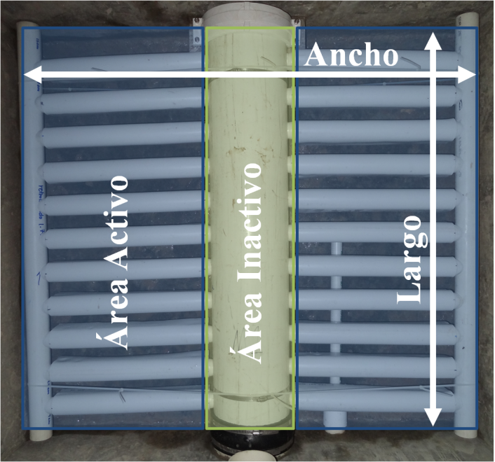

.. |Q.Fi| replace:: **PLACEHOLDER**
.. |N.FiLayer| replace:: **PLACEHOLDER**
.. |V.FiLayer| replace:: **PLACEHOLDER**
.. |W.FiMin| replace:: **PLACEHOLDER**
.. |B.FiManifoldBranch| replace:: **PLACEHOLDER**

.. _title_Dimensionamiento_del_Filtro:

***************************
Dimensionamiento del Filtro
***************************

Una vez definido el número de filtros, se calcula el caudal verdadero por filtro y se puede calcular el área superficial activa por filtro:

.. math::
    :label: active_surface_area

    A_{FiActivo} = \frac {{Q_{Fi}}/{N_{Capa}}}{V_{Fi}}

| Donde
| :math:`Q _{Fi}` = el caudal por filtro = |Q.Fi|
| :math:`N _{Capa}` = el número de capas por filtro = |N.FiLayer|
| :math:`V _{Fi}` = la velocidad de aproximación de filtración por capa = |V.FiLayer|

La definición del largo y del ancho del filtro es flexible hasta un cierto punto, siempre tomando en cuenta varias consideraciones constructivas y geometrías. En la herramienta de diseño se definen por las restricciones geométricas de la tubería de entrada y salida que lleva y trae el agua de la caja de entrada a la caja del filtro y de vuelta a la caja de salida. Las dimensiones de los accesorios de PVC para esta tubería que se funden en estas cajas y las tolerancias dejadas alrededor de ellos establecen un ancho mínimo para la caja del filtro, en este caso un ancho mínimo de |W.FiMin|.

Con este ancho mínimo, se estima el largo de la caja del filtro para poder definir el número de ramales por cada módulo de entrada y salida con una separación entre ramales de |B.FiManifoldBranch|. Una vez definido el número de ramales, se definen el largo verdadero y luego el ancho verdadero del filtro. Siempre se toma en cuenta consideraciones geométricas para la fabricación de los módulos y su montaje en la caja del filtro. Además, el ancho del tronco de retrolavado no contribuirá al área activo:

.. math::
    :label: active_surface_area_calc

    \acute Area_{Activo} = Largo_{Activo} \times Ancho_{Activo}

.. math::
    :label: true_width

    Ancho_{Verdadero} = Ancho_{Activo} + D_{Tronco}
