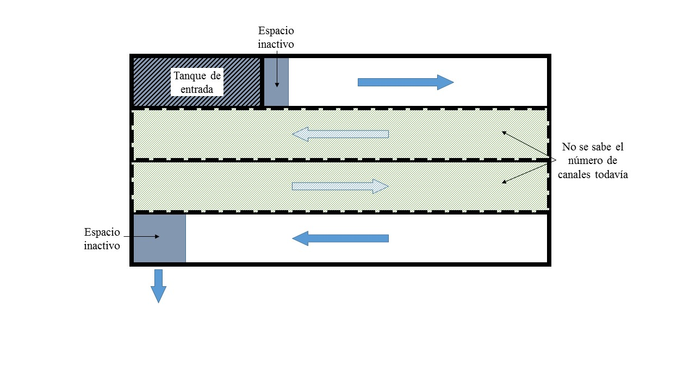
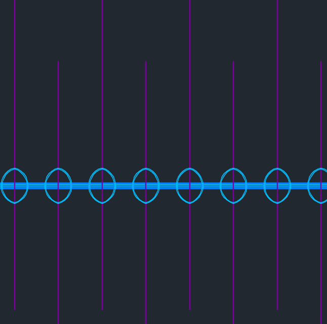

.. include:: ../global.rst

.. _title_Floc_Algoritmo_de_Diseño:

**********************
Algoritmo de Diseño
**********************

.. _heading_1_Entradas_al_algoritmo_y_asunciones:

1. Entradas al algoritmo y asunciones
----------------------------------------------------------

.. _table_Entradas_al_algoritmo_del_floculador:

.. csv-table:: Entradas al algoritmo del floculador
    :header: "Parámetro",	"Valor",	"Notas"

    Potencial de colisiones mínimo,	|CP.FlocBod|,
    Pérdida de carga máxima, |HL.FlocMax|, Entrada opcional del usuario. La pérdida de carga real podría salir menor si no se necesita.
    Longitud de los canales, |L.Floc|, Basada en la longitud del tanque de sedimentación para que compartan una pared.
    Profundidad de agua al final, |HW.FlocEnd|, Basada en la profundidad del tanque de sedimentación para que los dos tanques compartan una sola cimentación.
    Ancho mínimo de los canales, |W.FlocChannelMinPlate|, Basado en 1) el espacio que necesita un obrero para terminar de construir el canal cuando está dentro y 2) el ancho de la mitad de las láminas de policarbonato que se usan para los deflectores, para conservar el material.
    Ancho máximo de los canales, |W.FlocChannelMaxPlate|, Basado en el ancho total de las láminas de policarbonato que se usan para los deflectores.
    Radio de la longitud de cada expansión a la separación entre deflectores (H/S), |Pi.HSMin| - |Pi.HSMax|, El radio H/S debe estar en el rango eficiente.
    Radio de la tasa máxima a la tasa media de la disipación de energía (:math:`\alpha _{\varepsilon}`), |Alpha.EpsilonFloc|, La medida de la falta de uniformidad de la tasa de la disipación de energía, que corresponde a la geometría descrita por el radio H/S.
    Eficiencia del floculador (:math:`\alpha _{\psi}`), |Alpha.PsiFloc|, Eficiencia del floculador que corresponde al radio :math:`\alpha _{\varepsilon}`.
    Valor mínimo de la tasa media de la disipación de energía, |ED.FlocAveMinSettling|, Se impone esta restricción para evitar la sedimentación de los flóculos en el floculador.

.. _heading_2_Volumen_máximo_dedicado_al_tanque_de_entrada:

2. Volumen máximo dedicado al tanque de entrada
---------------------------------------------------------------

El tanque de entrada ocupa la primera parte del primer canal en el floculador
(:numref:`figure_floc_entrance_tank`). Habrá que restar este volumen, inútil para la
floculación, cuando se calcule el número y el ancho de los canales para lograr
el potencial de colisiones mínimo. Como primer paso del algoritmo se calcula la
longitud del tanque de entrada asumiendo el ancho mínimo de los canales, lo cual
corresponde a la longitud máxima del tanque para mantener la velocidad de
captura deseada (véase sección anterior). Esto da una estimación conservadora.
Las dimensiones reales del tanque de entrada se calcularán más adelante cuando
se sepa el ancho de los canales.

.. _figure_floc_entrance_tank:

    El tanque de entrada y el inicio y final del recorrido de agua por el
    floculador ocupan espacio que hay que restar del volumen dedicado a la
    floculación.

.. _heading_3_Volumen_del_floculador:

3. Volumen del floculador
-----------------------------------------

Hay dos restricciones para el volumen mínimo dedicado a la floculación:

 #. **Constructiva**: Tiene que haber por lo menos dos canales para mantener la configuración de la planta, para que tanto el tanque de entrada como los canales de entrada y salida de los tanques de sedimentación estén pegados al canal de limpieza. Ya se sabe la longitud y la profundidad de los canales del floculador en base a las dimensiones de los tanques de sedimentación. También hay una restricción para el ancho mínimo de cada canal. Multiplicando estas dimensiones mínimas y restando el volumen inactivo (:numref:`figure_floc_entrance_tank`) se encuentra el volumen mínimo dedicado a la floculación |Vol.FlocMinChannels|.
 #. **Hidráulica:** Asumiendo una geometría eficiente (:ref:`title_Conceptos_de_Diseño`), del potencial de colisiones y la pérdida de carga máxima se calcula la tasa media de la disipación de energía directamente:

     .. math::
         :label: efficient_avg_energy_dissipation_rate

         \bar{\varepsilon} = \Big(\frac{h_{eMax}g}{\psi \alpha_{\varepsilon}^\frac{1}{6}}\Big)^\frac{3}{2}

     | Donde:
     | :math:`\bar {\varepsilon}` = la tasa media de la disipación de energía máxima para este diseño = |ED.FlocAveMax|
     | :math:`h _{eMax}` = la pérdida de carga máxima en el floculador = |HL.FlocMax|
     | :math:`g` = la aceleración debida a la fuerza de gravedad ≈ :math:`9.81 \frac{m}{s^2}`
     | :math:`\psi` = el potencial de colisiones deseado = |CP.FlocBod|
     | :math:`\alpha _{\varepsilon}` = medida de la uniformidad de la disipación de energía = |Alpha.EpsilonFloc|

    Con esto se calcula el tiempo de retención necesario para lograr el potencial de colisiones, igual a |Ti.FlocMinCP|:

        .. math::
            :label: potential_collision_time

            \theta = \frac{\psi}{(\bar{\varepsilon})^\frac{1}{3}\alpha_{\psi}

    Por fin se calcula el volumen necesario, igual a |Vol.FlocMinCP|:

        .. math::
            :label: necessary_volume_calc

            Vol = Q \theta

    Donde :math:`Q` = el caudal de diseño de la planta = |Q.Plant|.

    El mayor de los volúmenes dados por estas dos restricciones será el volumen activo del floculador, igual a |Vol.FlocBod|.

.. _heading_4_Tasa_de_la_disipación_de_energía:

4. Tasa de la disipación de energía
--------------------------------------------------------

Como se mencionó en la sección anterior, en los diseños de AguaClara ya no se impone ninguna restricción directa para la tasa máxima de la disipación de energía relacionada al tamaño máximo de los flóculos. En lugar de ella se asume un valor razonable para la pérdida de carga máxima, una entrada opcional del usuario, que mantiene la tasa de la disipación de energía correspondiente dentro de un rango aceptable que asegura la floculación efectiva.

La *mínima* tasa de la disipación de energía sí tiene dos restricciones:

 #. **Hidráulica:** Con el volumen del floculador calculado en el paso anterior, y el tiempo de retención correspondiente, la tasa media de la disipación de energía necesaria para lograr el potencial de colisiones deseado se calcula directamente. Es igual a |ED.FlocAveCP|.

     .. math::
         :label: floc_average_collision_potential

         \bar{\varepsilon} = \Big(\frac{\psi}{\theta \alpha_{\psi}}\Big)^3

 #. **Práctica:** Es importante que el piso del floculador se mantenga libre de sedimento para no crear trabajo de mantenimiento innecesario y desperdicio de agua para la limpieza. A este fin se impone una restricción mínima para la tasa media de la disipación de energía, igual a |ED.FlocAveMinSettling|.

.. _heading_Ancho_de_los_canales_y_el_número_de_canales:

5. Ancho de los canales y el número de canales:
-----------------------------------------------------------------

Hay dos restricciones para el ancho mínimo de los canales:

 #.  **Constructiva:** Ya que están construidos generalmente de ladrillos con repello y dado fino, es importante que los canales del floculador de una planta AguaClara sean lo suficiente anchos que una persona se pueda meter adentro durante la construcción y trabajar libremente. Convenientemente, este ancho mínimo para la facilidad de construcción corresponde aproximadamente al ancho de la mitad de las láminas de policarbonato que se usan para los deflectores (|W.FlocChannelMinPlate|). Si el algoritmo opta por este ancho mínimo, las láminas de policarbonato se usan eficientemente con el mínimo número de cortes, así bajando los costos de fabricación.

 #. **Hidráulica:** Se ha asumido que la geometría del floculador sería eficiente. Es decir, el radio de la longitud de las expansiones a la separación entre deflectores (H/S) está dentro del rango |Pi.HSMin| a |Pi.HSTransition|. Ya se sabe también la profundidad al final del floculador (|HW.FlocEnd|) que corresponde a la profundidad del tanque de sedimentación. Con esta profundidad y la separación entre deflectores que mantiene el radio H/S dentro del rango eficiente, hay un ancho mínimo que da la tasa media de la disipación de energía que se calculó anteriormente.

     .. math::
         :label: min_width_energy_dissipation

         W_{Min} = \Big(\frac{H}{S}\Big)_{Min} \Big(\frac{K_B}{2H\bar{\varepsilon}}\Big)^\frac{1}{3}\frac{Q}{H}

 Donde en este caso :math:`H` = la profundidad al final del floculador = |HW.FlocEnd|.

 Es igual a |W.FlocChannelMinEfficient|. El ancho de los canales puede ser mayor, y se compensaría reduciendo la separación entre deflectores. Esta restricción para el ancho mínimo domina solamente para caudales grandes donde la separación entre deflectores quiere ser grande comparada con la profundidad de los canales.

El mayor de estos dos valores será el ancho mínimo de los canales, igual a |W.FlocChannelMin|.

También hay una restricción constructiva para el ancho máximo de los canales, que corresponde al ancho total de las láminas de policarbonato que se usan para los deflectores, igual a |W.FlocChannelMaxPlate|.

Para encontrar el número necesario de canales se asume que el ancho de cada canal será el mayor posible. Si esto significa que la separación entre deflectores se disminuye hasta que el radio H/S esté arriba del rango eficiente, se agregarán obstáculos en los espacios entre deflectores para reducir la longitud de las expansiones. Usar el ancho máximo en el cálculo del número de canales produce el número mínimo de canales, así reduciendo los costos de construcción.

Si todos los canales del floculador contribuyeran igualmente a la floculación, el número de canales se encontraría por la siguiente ecuación, redondeando para arriba.

.. math::
    :label: num_of_floc_channels

    N = \frac{Vol}{W_{Max}HL}

| Donde:
| :math:`L` = la longitud de los canales que corresponde a la longitud de los tanques de sedimentación = |L.Floc|

Sin embargo, del volumen total hay que restar el volumen que ocupa el tanque de entrada y el espacio inactivo al final del floculador donde el agua entra en el canal de entrada de los tanques de sedimentación. Además, tiene que haber un número par de canales. El verdadero número de canales, igual a |N.FlocChannels|, se encuentra por:

.. math::
    :label: true_floc_channel_number

    N_{Canal} = Ceil \Bigg(\frac{\frac{Vol}{W_{Max} H}+L_{Et}+T+2W_{SedCanal}}{L},2 \Bigg)

| Donde:
| La función :math:`Ceil\left(x,2\right)` redondea el valor x para arriba al número par más cercano
| :math:`L _{Et}` = longitud máxima del tanque de entrada en el primer canal = |L.EtMax|
| :math:`T` = grosor de la pared del tanque de entrada = |T.FlocDividingWall|
| :math:`W _{SedCanal}` = el ancho del canal de entrada de los tanques de sedimentación = |W.SedInletChannelPreWeir|

Ya con el número de canales se puede calcular el ancho mínimo de cada canal para alcanzar el volumen total calculado anteriormente, igual a |W.FlocChannelCP|:

:math:`W _{Min}=\frac{Vol}{H(N_{Canal}L-L_{Et}-T-2W_{SedCanal})}`

Por último, se toma el máximo del ancho calculado para alcanzar el volumen y el ancho mínimo que salió de las dos restricciones anteriores y se redondea para arriba al centímetro más cercano por facilidad de construcción. El ancho de los canales será |W.FlocChannel|.

.. _heading_6_Separación_entre_expansiones:

6. Separación entre expansiones
-------------------------------------------------

Existe la opción de colocar obstáculos entre los deflectores que provocan la misma expansión que sucede después de la vuelta alrededor de un deflector, para reducir la separación entre expansiones y mantener el radio H/S dentro del rango eficiente. Dado el ancho de los canales, la tasa de la disipación de energía nos da la separación máxima entre obstáculos que mantiene la geometría eficiente (véase :ref:`title_Conceptos_de_Diseño`):

.. math::
    :label: max_efficient_separation

    H_{MaxExp} = \Big(\frac{K_B}{2\bar{\varepsilon}}\Big)^\frac{1}{4} \bigg(\frac{(\frac{H}{S})_{Max}Q}{W}\bigg)^\frac{3}{4}

| Donde:
| :math:`H _{MaxExp}` = la separación entre expansiones, que podrían ser provocadas por obstáculos o deflectores

El número de expansiones entre cada dos deflectores se encuentra por la profundidad del tanque entre la separación máxima, igual a |N.FlocSpaceExpansions|:

.. math::
    :label: num_expansions_depth_separation

    N _{Exp}= ceil \Big(\frac{H_{Floculador}}{H_{MaxExp}}\Big)

Por fin, la separación real entre expansiones, igual a |H.FlocObs|, es:

.. math::
    :label: acutual_separation_between_expansions

    H _{Exp}=\frac{H_{Floculador}}{N_{Exp}}

.. _heading_7_Separación_entre_deflectores:

7. Separación entre deflectores
--------------------------------------------------

Ya con las otras dimensiones determinadas, la separación entre deflectores, igual a |S.FlocBaffleMin|, que corresponde a la tasa de la disipación de energía calculada anteriormente se encuentra por:

:math:`S _{Min}=\Big(\frac{K_B}{2H\bar{\varepsilon}}\Big)^\frac{1}{3}\frac{Q}{W}`

Sin embargo, tiene que haber un número entero de deflectores en el canal de longitud predeterminada. El número de espacios entre deflectores que mantiene la separación mínima se encuentra por:

.. math::
    :label: floc_baffel_sep_min

    N _{Esp}=Ceil\Big(\frac{L+T}{S_{Min}+T},2\Big)

| Donde:
| :math:`N _{Esp}` = el número de espacios entre deflectores en cada canal = |N.FlocChannelSpaces|
| La función :math:`Ceil\left(x,2\right)` redondea el valor :math:`x` para arriba al número par más cercano
| :math:`L` = la longitud del canal = |L.Floc|
| :math:`T` = el grosor de la lámina de policarbonato que se usa para los deflectores = |T.FlocBaffle|

Este número de espacios corresponde a |N.FlocChannelBaffles| deflectores en cada canal.

Por fin se calcula la separación precisa entre los deflectores, igual a |S.FlocBaffle|:

.. math::
    :label: precise_baffle_min

    S = \frac{L-N_{Def}T}{N_{Esp}}

| Donde:
| :math:`S` = la separación entre los deflectores = |S.FlocBaffle|
| :math:`N _{Def}` = el número de deflectores en cada canal = |N.FlocChannelBaffles|

Este paso que corrige la separación por la necesidad de tener un número entero de deflectores en cada canal es la causa de la diferencia entre los valores de diseño y los valores finales de la pérdida de carga (|HL.Floc| en vez de |HL.FlocBod|), la tasa media de la disipación de energía (|ED.FlocAve| en vez de |ED.FlocAveBod|), y el potencial de colisiones (|CP.Floc| en vez de |CP.FlocBod|). Ya que la corrección siempre reduce la separación, lo cual aumenta la tasa de la disipación de energía, todos estos parámetros terminan siendo mayor que los valores originales de diseño.

.. _heading_8_Cálculo_de_los_parámetros_finales:

8. Cálculo de los parámetros finales
---------------------------------------------------------

 #. El potencial de colisiones provocado por una sola expansión:

     .. math::
         :label: single_expansion_collision_potential

         \psi _{Exp}=\bigg(\frac{K_B^2H_{Exp}^4}{4\alpha_{\varepsilon}}\bigg)^\frac{1}{6}`

     | Donde:
     | :math:`\psi _{Exp}` = el potencial de colisiones para una expansión = |CP.FlocExpansion|
     | :math:`H _{Exp}` = la separación entre expansiones = |H.FlocObs|

    El potencial de colisiones total del floculador:

     .. math::
         :label: floc_total_potential_collisions

         \psi _{Floc}=N_{Exp}\psi_{Exp}

     | Donde:
     | :math:`\psi _{Floc}` = el potencial de colisiones total del floculador = |CP.Floc|
     | :math:`N _{Exp}`` = el número de expansiones en el floculador = |N.FlocExpansions|

 #. La velocidad media del fluido:

     .. math::
         :label: floc_avg_fluid_velocity

        V = \frac{Q}{SW}

     | Donde:
     | :math:`V` = la velocidad media del fluido = |V.Floc|
     | :math:`S` = la separación entre deflectores = |S.FlocBaffle|
     | :math:`W` = el ancho de los canales = |W.FlocChannel|

 #. La pérdida de carga:

     .. math::
         :label: floc_headloss_calc

         h_e = K_B\frac{V^2}{2g} N_{Exp}

     | Donde:
     | :math:`h_e` = la pérdida de carga total del floculador = |HL.Floc|
     | :math:`V` = la velocidad media del fluido = |V.Floc|
     | :math:`g` = la aceleración debida a la gravedad = :math:`9.81 \frac {m}{s^2}`

 #. La tasa real de la disipación de energía después de la corrección de la separación entre deflectores, igual a |ED.FlocAve|:

     .. math::
         :label: after_correction_dissipation_rate

         \bar{\varepsilon} = \frac{K_B}{2H_{Exp}}\Big(\frac{Q}{WS}\Big)^3

    Y la tasa máxima de la disipación de energía que corresponde, igual a |ED.FlocMax|:

     .. math::
         :label: floc_max_dissipation_rate

         \varepsilon_{Max} = \alpha_{\varepsilon}\bar{\varepsilon}

 #. El gradiente medio de velocidad, igual a |G.FlocAve|:

     .. math::
         :label: avg_vel_gradient

         G = \sqrt{\frac{\bar{\varepsilon}}{v}}

     Donde :math:`v` es la viscosidad cinemática del agua, igual a |Nu.Water|.

 #. El tiempo de retención total, incluyendo el espacio inactivo al final del último canal y contribuido por la pérdida de carga, igual a |Ti.Floc|:

     .. math::
         :label: total_retention_time_1

         Vol _{Total}=WLH=W(N_{Canal}L_{Canal}-L_{Et}-T)\Big(H+\frac{h_e}{2}\Big)

     .. math::
         :label: total_retention_time_2

         \theta = \frac{Vol_{Total}}{Q}

    El tiempo de retención activo se calcula restando el volumen inactivo, y es
    igual a |Ti.FlocActive|.

.. _heading_9_Diseño_de_los_obstáculos:

9. Diseño de los obstáculos
---------------------------------------

Cada obstáculo es dos pedazos de tubo de PVC entre los cuales el agua tiene que fluir (:numref:`figure_deflectors_lateral`). Las expansiones provocadas por los obstáculos deben ser iguales a las que provocan los deflectores. Se asume que, por la forma redonda de los tubos y la curva gradual de las líneas de corriente, no hay vena contracta que sigue el obstáculo en el flujo, sino una expansión inmediata. Por tanto, el ancho del espacio entre los tubos debe ser igual al ancho de la parte más estrecha de la vena contracta que sigue después de la vuelta alrededor de un deflector:

.. math::
    :label: width_between_tubes

    W = S_{Def}(1-\Pi_{VC})

| Donde:
| :math:`W` = el ancho del espacio entre los tubos = |W.FlocObstacleWake|
| :math:`S _{Def}` = la separación entre deflectores = |S.FlocBaffle|
| :math:`\Pi _{VC}` = coeficiente de vena contracta para la vuela alrededor de un deflector = |Pi.VCBaffle|

.. _figure_deflectors_lateral:

    Vista lateral de los obstáculos entre los deflectores.

Por fin, el algoritmo busca el tamaño mínimo del tubo que ocupe el espacio necesario, igual a |ND.FlocObs|.

.. _heading_10_Alturas:

10. Alturas
-------------------------

La altura del floculador se calcula sumando desde el nivel de agua en el canal de entrada al tanque de sedimentación:

.. math::
    :label: add_water_floc_height

    H_{Floc} = HW_{Final}+h_e+H_{Borde}

| Donde:
| :math:`H _{Floc}` = la altura total del tanque = |H.Floc|
| :math:`HW _{Final}` = la profundidad de agua al final del floculador, determinada por el canal de entrada al tanque de sedimentación = |HW.FlocEnd|
| :math:`h_e` = la pérdida de carga total del floculador = |HL.Floc|
| :math:`H _{Borde}` = el espacio libre en la parte arriba del tanque = |H.PlantFreeboard|

La altura de la losa del floculador es relativa a la solera inferior que amarra los tanques de sedimentación y el floculador. La parte abajo de esta solera es el nivel cero en el dibujo de AutoCAD. La parte abajo de la losa del floculador está al mismo nivel que la parte inferior de la solera, así que el nivel del fondo del tanque sólo depende del grosor de la losa |T.FlocSlab|.

.. _heading_11_Las_compuertas_entre_los_canales:

11. Las compuertas entre los canales
---------------------------------------------

En el diseño de las compuertas el área perpendicular al flujo de agua se conserva de tal forma que no hay regiones con tasas de la disipación de energía muy arriba del límite del diseño. Es decir, el área de la compuerta es igual al área del espacio entre los deflectores. La compuerta debe caber en el espacio antes del primer deflector en el canal. Por tanto, el ancho se calcula en base a la separación entre deflectores:

.. math::
    :label: width_based_on_sep

    W = S-d

| Donde:
| :math:`W` = el ancho de la compuerta = |W.FlocPort|
| :math:`S` = la separación entre deflectores = |S.FlocBaffle|
| :math:`d` = la brecha entre el borde de la compuerta y el primer deflector = |S.FlocBaffleSetBackPlastic|

Con el fin de conservar el área perpendicular al flujo en todo el recorrido de agua a lo largo del floculador, la altura de la compuerta se calcula como:

.. math::
    :label: gate_height_calc

    H = \frac{SW_{Canal}}{W_{Compuerta}}

Donde :math:`H` = la altura de la compuerta = |H.FlocPort|.

.. _heading_12_Desagües_de_los_canales:

12. Desagües de los canales
------------------------------------

Con la excepción del primero, todos los canales del floculador cuentan con un
desagüe pegado al canal de limpieza de la planta. Se diseñan para que toda el
agua se vaya del floculador dentro de |Ti.FlocDrain|, lo cual da el siguiente
caudal de diseño:

.. math::
    :label: floc_drain_design_flow

    Q _{Des}=\frac{Vol_{Floc}}{(N_{Canales}-1)Ti}

| Donde:
| :math:`Q _{Des}` = el caudal de diseño de cada desagüe = |Q.FlocDrain|
| :math:`Vol _{Floc}` = el volumen total de agua en el floculador cuando está
  lleno = |Vol.Floc|
| :math:`N _{Canales}` = el número de canales en el floculador = |N.FlocChannels|
| :math:`Ti` = el tiempo máximo que lleva el proceso de vaciar el floculador
  = |Ti.FlocDrain|
