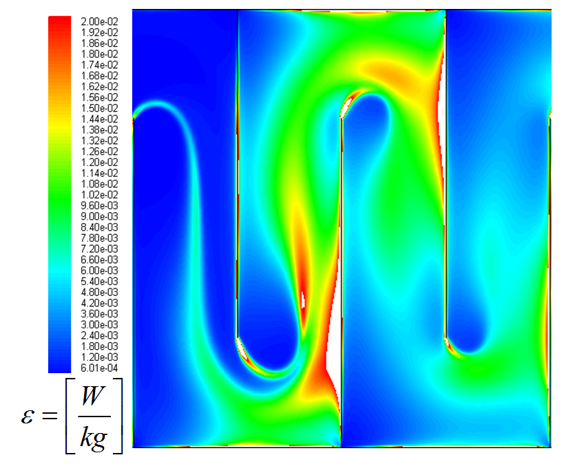
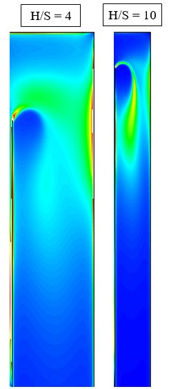

.. |CP.FlocBod| replace:: **PLACEHOLDER**
.. |Pi.HSMin| replace:: **PLACEHOLDER**
.. |Pi.HSTransition| replace:: **PLACEHOLDER**
.. |Pi.JetPlane| replace:: **PLACEHOLDER**
.. |Pi.VCBaffle| replace:: **PLACEHOLDER**
.. |K.FlocBaffle| replace:: **PLACEHOLDER**
.. |ED.SedInlet| replace:: **PLACEHOLDER**
.. |HL.SedDiffuser| replace:: **PLACEHOLDER**

.. _title_Conceptos_de_Diseño:

********************
Conceptos de Diseño
********************

.. _heading_El_potencial_de_colisiones_y el_rendimiento_del_floculador:

El potencial de colisiones y el rendimiento del floculador
----------------------------------------------------------

Las partículas suspendidas en el agua deben colisionar cierto número de veces con el fin de alcanzar el tamaño suficiente para sedimentarse en el tanque de sedimentación. Para lograr el número adecuado de colisiones se necesita tiempo y velocidades relativas que juntan los recorridos de las partículas. Los parámetros tradicionales en el diseño de los floculadores para tomar en cuenta estas dos necesidades son 1) el tiempo de retención :math:`\theta` y 2) el gradiente de velocidad :math:`G` de Camp y Stein (1955). Los diseños convencionales normalmente caracterizan el potencial de colisiones como el producto de estos dos números :math:`G\theta`.

Sin embargo, se ha demostrado que el gradiente de velocidad es un parámetro válido para describir la floculación únicamente cuando el flujo es laminar, o cuando la separación típica entre partículas es menor que la escala característica de la turbulencia :math:`L _{K}`. Con flujo laminar la tasa de colisiones entre partículas es proporcional al gradiente medio de velocidad. Este caso casi nunca se da en las aplicaciones de ingeniería sanitaria de tratamiento de agua potable y aguas residuales, donde los floculadores son principalmente turbulentos. El gradiente de velocidad no describe la floculación en el rango inercial, donde el transporte de partículas por medio de los remolinos turbulentos es el fenómeno que domina el proceso (Cleasby 1984, Weber-Shirk 2010).

Para los floculadores turbulentos la tasa media de la disipación de energía elevada a un tercio :math:`\varepsilon^\frac{1}{3}` es mejor que el gradiente de velocidad para describir la floculación, ya que la separación entre partículas por lo general es mayor que la escala característica de la turbulencia :math:`L _{K}`. La tasa de la disipación de energía está relacionada al gradiente de velocidad por la fórmula:

:math:`\varepsilon=vG^2`

Donde :math:`v` es la viscosidad cinemática del fluido.

El potencial de colisiones que se usa para el diseño de los floculadores turbulentos de AguaClara se define como:

:math:`\psi = \alpha _{\psi}\theta \varepsilon ^\frac{1}{3}`

| Donde:
| :math:`\psi` = potencial de colisiones (:math:`m ^ {2/3}`)
| :math:`\alpha _{\psi}` = eficiencia del floculador
| :math:`\theta` = tiempo de retención del floculador (s)
| :math:`\varepsilon` = tasa media de la disipación de energía (W/kg)

El problema principal con el gradiente medio de velocidad :math:`G` es la dependencia de la viscosidad, la cual no tiene sentido ya que las fuerzas viscosas no importan en el rango inercial donde sucede la floculación ortocinética. En la práctica, la diferencia entre el gradiente :math:`G` y la tasa de la disipación de energía :math:`\varepsilon` como parámetros de diseño es la dependencia de :math:`G` en la temperatura por el efecto de la viscosidad del fluido. Para una temperatura constante, los parámetros prácticamente son intercambiables ya que los dos están directamente relacionados con la cantidad de energía gastada. La distinción más importante del potencial de colisiones usado aquí es la consideración de la uniformidad de la disipación de energía, tomada en cuenta con el factor de eficiencia :math:`\alpha _{\psi}` (véase la siguiente sección).

El potencial de colisiones es una propiedad del floculador en sí, independiente de las características del agua cruda, la dosis de coagulante, y el diseño del proceso de sedimentación. Además, para los floculadores hidráulicos de AguaClara resulta que es independiente también del caudal de agua. Aunque la tasa de la disipación de energía y el tiempo de retención dependen del caudal, el producto es una función únicamente del tamaño y la geometría del reactor. Se diseña el floculador de la planta AguaClara con un potencial de colisiones mínimo de |CP.FlocBod|, el cual ha sido exitoso en las plantas y los simuladores anteriores con turbiedad baja, y corresponde generalmente a los valores recomendados de :math:`G\theta` para los diseños convencionales de floculadores de esta escala.

La remoción de partículas en los procesos de floculación y sedimentación depende de muchos factores que no se toman en cuenta con el potencial de colisiones, como se ha mencionado. Swetland et al (2014) desarrolló un modelo predictivo amplio de estos procesos que incluye: las características del agua cruda tal como la carga de sedimento y el tamaño característico de las partículas; la cobertura fraccional del coagulante en los sólidos, relacionado con la dosis y la demanda; el tipo de coagulante; y el proceso de sedimentación. El modelo es escalable ya que está basado en la física fundamental del proceso y confirmado con datos de pruebas de diversas condiciones. Para la floculación turbulenta el modelo en su forma actual dice:

:math:`pC ^* = \frac{9}{8}log\Bigg(\frac{8}{9} \Big(\frac{6}{\pi} \Big)^\frac{8}
{9} \pi k \Gamma \phi_{0}^\frac{8}{9} \frac{t \varepsilon^\frac{1}{3}}{d_
{Coloide}^\frac{2}{3}}+1 \Bigg)`

| Donde:
| :math:`pC ^* = -log\bigg(\frac{C_{sedimentada}}{C_{afluente}}\bigg)` = una medida de la remoción de sólidos suspendidos
| :math:`\Gamma` = la cobertura fraccional de la superficie de los sólidos con coagulante, relacionada a la dosis, la mezcla rápida, y la demanda de coagulante del agua cruda
| :math:`\phi_0` = la fracción del volumen de la suspensión ocupada por los sólidos al inicio del proceso
| :math:`t` = el tiempo de floculación
| :math:`\varepsilon` = la tasa media de la disipación de energía
| :math:`d _{Coloide}` = el tamaño característico de las partículas primarias
| :math:`k` = un constante de velocidad, efectivamente un factor de ajuste

Sin embargo, a diferencia de algunas metodologías convencionales, en el diseño del floculador de AguaClara no se considera ninguna característica del agua cruda aparte de la necesidad general de los procesos de floculación y sedimentación para la remoción de sólidos suspendidos. Es decir, el diseño es independiente de los resultados de pruebas de jarra u otros análisis preliminares. Los únicos factores del modelo predictivo que se toman en cuenta en el diseño son los relacionados al potencial de colisiones (la tasa de la disipación de energía; la uniformidad espacial de la turbulencia – véase la siguiente sección; y el tiempo de retención). Y estos factores son independientes del agua cruda, ya que siempre se da |CP.FlocBod| de potencial de colisiones como mínimo, lo cual ha sido suficiente aún para las suspensiones más difíciles con poca carga de sedimento. En lugar de conocer las características del agua cruda, el objetivo es diseñar un floculador que pueda flocular efectivamente cualquier suspensión con cobertura suficiente de coagulante. Por eso la herramienta de diseño no pide ninguna entrada del usuario relacionada a las pruebas de tratabilidad. El agua cruda sólo entra en el diseño de los dosificadores del coagulante y cloro donde la demanda de estos dos químicos en los momentos más críticos determina la dosis máxima.

Se ha formulado el diseño de AguaClara para que sea independiente del agua cruda por dos razones principales:

 #. Los resultados de las pruebas de jarra pueden ser útiles para determinar la eficiencia de la coagulación variando la dosis de coagulante, pero normalmente no se aplican a la floculación de escala real por las diferencias fundamentales en los procesos, tal como la gran variedad de gradientes de velocidad locales en los reactores con agitadores.
 #. Las características del agua cruda siempre varían con el tiempo, y en muchos casos es difícil obtener un juego representativo de datos dentro del tiempo y el presupuesto disponibles para el estudio y diseño de la planta. Una de las metas principales de AguaClara es brindar soluciones efectivas bajando costos y tiempos lo más posible para poder servir al máximo número de personas.

Como punto final relacionado al rendimiento del floculador, en el caso de AguaClara su diseño no toma en cuenta la floculación que sucede en el tanque de sedimentación. El manto de lodos es una suspensión de flóculos que se mantiene en la parte inferior del tanque de sedimentación y que provee la oportunidad para colisiones entre partículas causadas por la sedimentación diferencial y la mezcla provocada por los chorros de entrada. Por tanto, es probable que en realidad el floculador esté sobredimensionado y que el potencial de colisiones total no será el limitante en la remoción de partículas.

.. _heading_Eficiencia del floculador:

Eficiencia del floculador
-------------------------

En el cálculo del potencial de colisiones se aplica un factor de eficiencia :math:`\alpha _{\psi}` para tomar en cuenta la falta de uniformidad de la turbulencia en el flujo. La expansión del chorro provocada por la vuelta alrededor de un deflector ocupa solamente una parte del espacio entre las siguientes láminas (:numref:`figure_floc_energy_dissipation`). Esta expansión es donde se encuentra la turbulencia que causa las velocidades relativas que juntan las partículas suspendidas. Dentro del chorro hay regiones de alta disipación de energía, la cual indica turbulencia violenta y altas velocidades relativas, y hay también zonas de turbulencia más suave. De igual manera hay regiones del flujo que contribuyen muy poco a la floculación porque están fuera de la expansión del chorro. Si la tasa de la disipación de energía fuera uniforme el factor :math:`\alpha _{\psi}` sería igual a uno. Esto sería un floculador ideal, con turbulencia uniforme y todo el volumen contribuyendo igualmente a la unión de partículas.

.. _figure_floc_energy_dissipation:

    Distribución de la tasa de la disipación de energía en un floculador según análisis de CFD.

Una medida de la falta de uniformidad de la disipación de energía en el floculador es el radio :math:`\alpha _{\varepsilon}`, definido como:

:math:`\alpha _{\varepsilon}= \frac{\varepsilon_{max}}{\bar{\varepsilon}}`

| Donde:
| :math:`\varepsilon _{max}` = la tasa máxima de la disipación de energía (W/kg)
| :math:`\bar {\varepsilon}` = la tasa media de la disipación de energía (W/kg)

La geometría de los deflectores determina la uniformidad de la disipación de energía. En particular, el radio de la longitud de la expansión del chorro a la separación entre los deflectores (H/S) está relacionado directamente a la uniformidad de la expansión. Es decir, este radio determina la eficiencia del floculador en cuanto al porcentaje del espacio que contribuye a la unión de partículas. Si el espacio para la expansión es muy largo comparado con la separación entre los deflectores, la expansión del chorro se termina en la primera parte del espacio disponible y se desperdicia una gran parte del volumen del floculador (:numref:`figure_energy_dissipation_uniformity`).

.. _figure_energy_dissipation_uniformity:

    El radio de la longitud de la expansión a la separación entre deflectores (H/S) determina la uniformidad espacial de la disipación de energía.

Según una serie de análisis de CFD, el rango óptimo del radio H/S está entre |Pi.HSMin| y |Pi.HSTransition|. Aquí el radio :math:`\alpha _{\varepsilon}` es igual a 2. Arriba del rango óptimo la uniformidad de la turbulencia se deteriora y :math:`\alpha _{\varepsilon}` está relacionado con la geometría por la siguiente fórmula:

:math:`\alpha _{\varepsilon}=\frac{\Pi_{Jet}^3}{\Pi_{VC}^4} \frac{2}{K_{B}}\Big(\frac{H}{S} \Big)`

| Donde:
| :math:`\Pi _{Jet}` = un factor relacionado a la geometría del flujo al pasar alrededor de un deflector = |Pi.JetPlane|
| :math:`\Pi _{VC}` = el coeficiente de vena contracta para el deflector = |Pi.VCBaffle|
| :math:`K _{B}` = el coeficiente de pérdida de carga para la expansión del chorro = |K.FlocBaffle|
| :math:`\frac {H}{S}` = el radio de la longitud de la expansión a la separación entre los deflectores

En los diseños anteriores de AguaClara las restricciones constructivas impedían una geometría eficiente. La altura mínima de los canales se determinaba por la altura del tanque de sedimentación adyacente, y el ancho mínimo de los canales se determinaba por el espacio necesario durante la construcción. Por el ancho del canal la separación entre deflectores tenía que ser menor que la óptima para mantener una velocidad que levantara los flóculos sedimentados del piso. Por simplicidad de fabricación, sólo había una expansión entre cada dos láminas. Especialmente para caudales menores, el resultado de estas restricciones era un radio H/S muy arriba del rango óptimo. Había que compensar con un floculador más grande para cumplir el objetivo del potencial de colisiones.

Ahora se diseña el floculador con obstáculos adicionales entre las láminas que provocan expansiones. De esta manera se reduce la longitud del espacio después de cada expansión y se puede mantener el radio H/S dentro del rango óptimo. Los obstáculos son dos pedazos de tubo de PVC entre los cuales el agua tiene que fluir, causando una contracción seguida por la misma expansión que ocurre después de la vuelta alrededor de un deflector.

Por fin, la eficiencia del floculador :math:`\alpha _{\psi}` se encuentra por:

:math:`\alpha _{\psi}=\frac{1}{\alpha_{\varepsilon}^\frac{1}{6}}`

.. _heading_La_tasa_máxima_de_la_disipación_de_energía:

La tasa máxima de la disipación de energía
------------------------------------------

El tamaño máximo de los flóculos depende no precisamente de la velocidad en el floculador, como se ha sugerido en algunas recomendaciones convencionales de diseño, sino de la tasa máxima de la disipación de energía en el flujo de agua. Los puntos de turbulencia más violenta rompen los flóculos con la fuerza cortante de los remolinos turbulentos adyacentes. En la expansión del chorro que sigue después de la vuelta alrededor de un deflector de un floculador hidráulico, la tasa máxima de la disipación de energía se encuentra por la fórmula:

:math:`\varepsilon _{max}=\frac{\big(\Pi_{Jet}V_{Jet}\big)^3}{S\Pi_{VC}}`

| Donde:
| :math:`V _{Jet}` = la velocidad en el chorro generado por el deflector
| :math:`S` = la separación entre los deflectores

Con el objetivo de construir un floculador que permite la formación de flóculos del mayor tamaño posible, antes en el diseño de AguaClara se imponía una restricción conservadora en la tasa máxima de la disipación de energía. La restricción hacía posible los flóculos muy grandes, pero exigía un tiempo de retención mayor para lograr el potencial de colisiones predeterminado.

Más recientemente se ha investigado la idea de que no es el tamaño máximo de los flóculos que realmente determina la calidad de agua sedimentada, sino el número de partículas primarias que no han floculado al alcanzar el fin del proceso. Por ejemplo, los flóculos más grandes, si se dividen en dos por la fuerza cortante del flujo, siempre se captarán en el tanque de sedimentación, ya que la velocidad de captura es mucho menos que la velocidad de sedimentación de estas partículas. Las partículas que constituyen la turbiedad del efluente son mucho más pequeñas, y es probable que su origen se deba a la falta de cobertura del coagulante, no a la alta disipación de energía.

En varias simulaciones de laboratorio en que se variaron el tiempo de retención y el gradiente de velocidad en un floculador de flujo laminar, los datos preliminares sugieren que se puede compensar una reducción en el tiempo de retención con un aumento en el gradiente de velocidad (así manteniendo constante el potencial de colisiones) para producir el mismo resultado con respecto a la calidad de agua sedimentada. Al aumentar el gradiente de velocidad se limita el tamaño máximo de los flóculos. Este resultado sugiere que el tamaño máximo de los flóculos no es crítico para el rendimiento del sistema de tratamiento.

Al final, los flóculos serán sometidos a una tasa de la disipación de energía de |ED.SedInlet| en la entrada al tanque de sedimentación para causar |HL.SedDiffuser| de pérdida de carga y así mantener la distribución de caudal uniforme a lo largo del manifold. Los datos de la simulación de laboratorio que se hizo para probar este diseño sugieren que no se disminuye la calidad de agua sedimentada hasta que la tasa de la disipación de energía en la entrada al tanque supera 0.5 W/kg. Dado que el tamaño máximo de los flóculos será limitado por la entrada al tanque de sedimentación, no tiene sentido diseñar un floculador para producir flóculos grandes que después se van a romper, sacrificando economía de construcción.

.. _heading_Las_dimensiones_del_floculador_y_la_tasa_de_la_disipación_de_energía:

Las dimensiones del floculador y la tasa de la disipación de energía
--------------------------------------------------------------------

Aunque ya no se impone la restricción en la tasa máxima de la disipación de energía, sigue siendo un parámetro fundamental en el diseño. La siguiente derivación que relaciona la tasa de la disipación de energía con las dimensiones del tipo de floculador de flujo vertical que se usa en las plantas AguaClara será importante en el algoritmo de diseño.

La tasa media de la disipación de energía se puede escribir de la forma:

:math:`\bar {\varepsilon} = \frac{Energ\acute{\imath}a \hspace{1mm} perdida}{Tiempo}= \frac{K_B \frac{\bar{V}^2}{2}}{\theta_B}= \frac{K_B\bar{V}^3}{2H}`

| Donde:
| :math:`K_B` = coeficiente de la pérdida de carga para la vuelta alrededor de un deflector = |K.FlocBaffle|
| :math:`\bar V` = velocidad media en el floculador
| :math:`\theta _B` = tiempo de retención del espacio entre dos deflectores = :math:`\frac {V} {H}`
| :math:`H` = longitud de la expansión del chorro después de un deflector, antes de la siguiente contracción

El área perpendicular a la dirección del flujo en el espacio entre deflectores es el producto del ancho del canal y la separación entre deflectores. Por lo tanto, la velocidad media se puede escribir de la siguiente forma:

:math:`\bar{V} = \frac{Q}{A}= \frac{Q}{WS}`

| Donde:
| :math:`W` = el ancho del canal
| :math:`S` = la separación entre deflectores

Sustituyendo esta expresión para la velocidad media, la tasa media de la disipación de energía se escribe:

:math:`\bar{\varepsilon} = \frac {K_BQ^3}{2HW^3S^3}`

Esta fórmula se puede usar de varias maneras dependiendo de cómo está restringido el diseño. Tres casos importantes en el algoritmo de diseño son:

 #. Para encontrar el ancho mínimo del canal W cuando el radio H/S está
    restringido al valor mínimo del rango eficiente (Pi.HSMin):
    :math:`W= \Big(\frac{H}{S} \Big)_{Min} \Big(\frac{K_B}{2H\bar{\varepsilon}}
    \Big)^\frac{1}{3} \frac{Q}{H}`

 #. Para calcular la separación máxima entre expansiones que mantiene el radio
    H/S dentro del rango eficiente:
    :math:`H_{Max} = \Big(\frac{K_B}{2\bar{\varepsilon}} \Big)^\frac{1}{4}
     \bigg(\frac{(\frac{H}{S})_{Max}Q}{W} \bigg)^\frac{3}{4}`

 #. Para encontrar la separación entre deflectores cuando ya se saben las otras
    dimensiones:
    :math:`S = \Big(\frac{K_B}{2H\bar{\varepsilon}}\Big)^\frac{1}{3} \frac{Q}{W}`

.. _heading_Bibliografía:

Bibliografía
------------

Cleasby, J., 1984. Is velocity gradient a valid turbulent flocculation
parameter? J. Environ. Eng. 110 (5), 875e897.

Swetland, K., Weber-Shirk, M., and Lion, L. (2014). ”Flocculation-Sedimentation
Performance Model for Laminar-Flow Hydraulic Flocculation with Polyaluminum
Chloride and Aluminum Sulfate Coagulants.” J. Environ. Eng., 140(3), 04014002.

Weber-Shirk, M. L., Lion, L. W., 2010. Flocculation model and collision
potential for reactors with flows characterized by high peclet numbers. Water
Res. 44 (18), 5180-5187.
 
