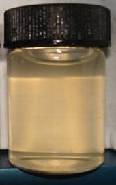
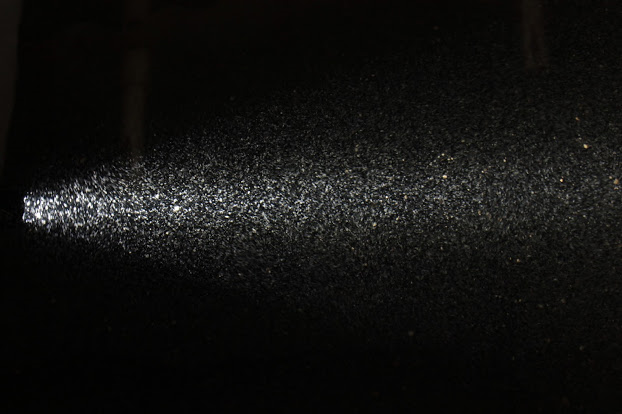
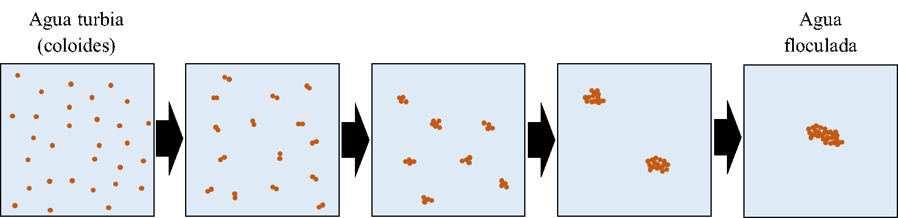
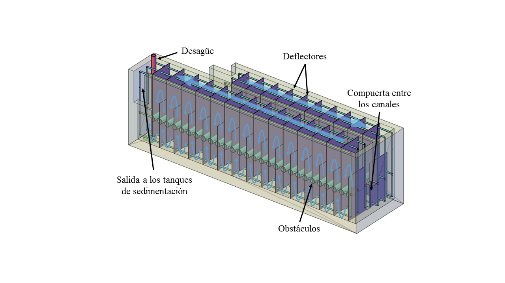
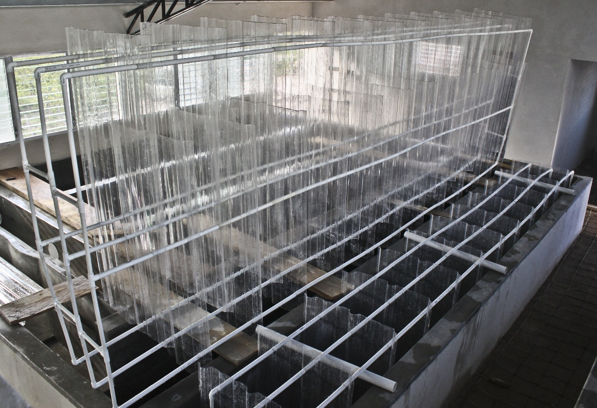
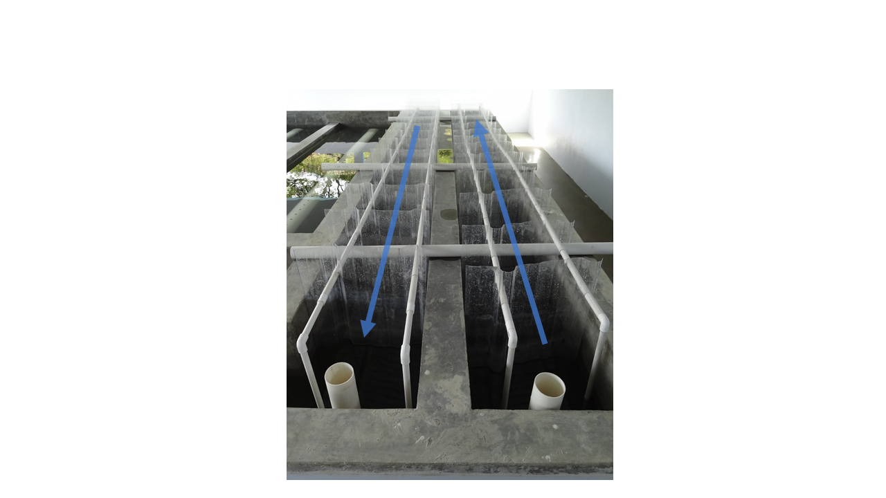

.. |ND.FlocMod| replace:: **PLACEHOLDER**
.. |ND.FlocSpacer| replace:: **PLACEHOLDER**
.. |ND.FlocDrain| replace:: **PLACEHOLDER**

.. _title_Floc_Propósito_y_Descripción:

************************
Propósito y Descripción
************************

El floculador hace que las partículas suspendidas en el agua se choquen y se aglomeren para formar agregados de mayor tamaño que se llaman flóculos. Los **flóculos** tienen peso suficiente para poder sedimentarse fácilmente en el tanque de sedimentación. La mezcla suave del agua con coagulante en este proceso promueve las colisiones entre partículas.

.. _figure_turbid_water:

    El agua turbia en el frasco lleva partículas coloidales, las cuales no se sedimentan. El objetivo del floculador es aumentar el tamaño de las partículas para que se puedan quitar del agua por la fuerza de gravedad.

.. _figure_floc:

    Los flóculos iluminados en la parte final de un floculador ya tienen tamaño visible.

.. _figure_floc_diagram:

    La formación de un flóculo a través de choques entre partículas en el agua. En realidad, un flóculo lleva miles de las partículas primarias.

En la planta AguaClara el floculador es una serie de canales con láminas y tubos que dirigen el flujo de agua. Al dar la vuelta alrededor de un “deflector” o pasar entre dos tubos, el chorro de agua se expande. Esta expansión turbulenta es donde se crean las condiciones que promueven choques entre las partículas causando velocidades relativas en el flujo.

.. _figure_floculator_isometric:

    Vista isométrica de un floculador de AguaClara con paredes transparentes. Las flechas azules indican la dirección del flujo de agua.

Los deflectores se fabrican de láminas de policarbonato. Están conectados por una estructura de tubos de PVC de |ND.FlocMod|, con separadores de |ND.FlocSpacer|. Se usa el material flexible para que los deflectores quepan precisamente en los canales sin brechas entre las láminas y las paredes. Los módulos son fáciles de sacar para limpieza o mantenimiento del floculador (:numref:`figure_floc_deflectors`).

.. _figure_floc_deflectors:

    Los módulos de deflectores del floculador.

Con la excepción del primero, cada canal del floculador cuenta con un desagüe de |ND.FlocDrain| de diámetro en el extremo pegado al canal de limpieza de la planta. Los desagües se operan de manera sencilla quitando un niple largo de PVC que se extiende arriba del agua (:numref:`figure_floc_elev_deflectors`).

.. _figure_floc_elev_deflectors:

    Imagen de un floculador con los módulos de deflectores elevados y apoyados por los tubos cruzados. Esto se hace para que los deflectores bajos no se dañen por la presión estática del agua cuando se están llenando los canales. Los niples de los desagües se ven en el primer plano.
