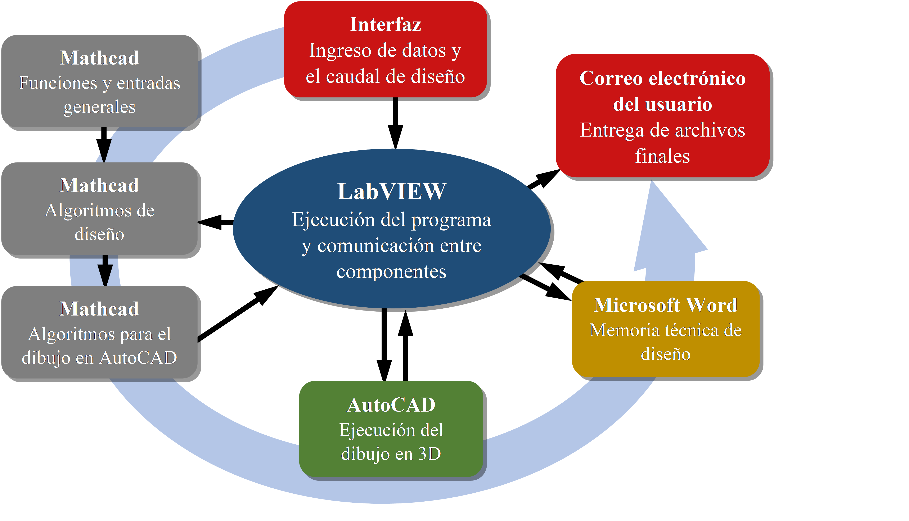

.. _La_Herramienta_de_Diseño_Automática:

***********************************
La Herramienta de Diseño Automática
***********************************

.. _heading_concepto_diseño_paramétrico_generalizadoa:

Concepto: diseño paramétrico generalizado
-----------------------------------------
*La Herramienta de Diseño Automática* de AguaClara es un software desarrollado en la Universidad de Cornell para facilitar la diseminación de la tecnología. A la interfaz en la página web de AguaClara se le ingresa el caudal de diseño y otras entradas que el usuario puede especificar. El programa se ejecuta para producir un modelo de AutoCAD en tres dimensiones que contiene todas las estructuras, tuberías, y accesorios hidráulicos para una planta AguaClara de esa capacidad. De este modelo se puede sacar la información necesaria para la construcción de esa instalación, tal como los cortes que se adaptan para los planos de construcción y la configuración de todos los accesorios y tubería.

.. _heading_funcionamiento_del_programa:

Funcionamiento del programa
---------------------------
El código principal se ha escrito en el programa Mathcad de PTC. Este código está dividido entre archivos para:

 #. Funciones y definiciones generales.
 #. Los cálculos que definen las dimensiones y especificaciones de cada proceso de tratamiento.
 #. Los algoritmos que por fin dibujan la planta en AutoCAD.

Los archivos de la tercera categoría producen el texto que se le ingresa a la línea de comando de AutoCAD para ejecutar el proceso del dibujo. De igual manera, los valores de muchos variables del programa se le ingresan a Microsoft Word para producir esta documentación del diseño. El software que facilita la comunicación entre la interfaz, Mathcad, Microsoft Word, y AutoCAD está escrito en el programa LabVIEW (:numref:`figure_aide_flowchart`).

.. _figure_aide_flowchart:

    La secuencia de ejecución y el flujo de información en la Herramienta de Diseño Automática de AguaClara.
