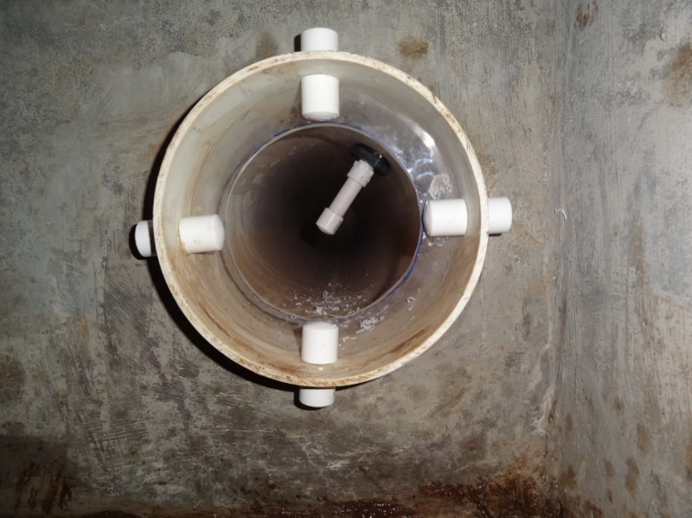
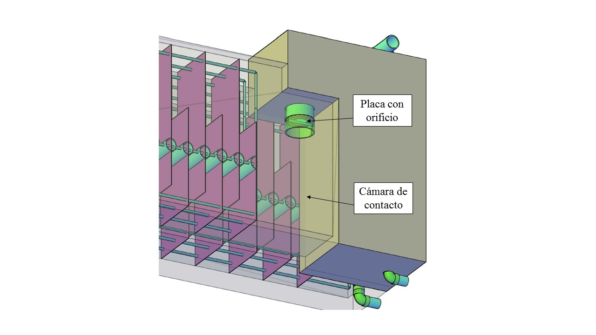

.. include:: ../global.rst

.. _title_Propósito_y_Descripción:

***************************
Propósito y Descripción
***************************

Después de recibir la dosis de coagulante, el agua pasa por la mezcla rápida.
Este proceso sirve para distribuir el coagulante uniformemente en el agua cruda.
En esta planta, la mezcla ocurre en la expansión turbulenta del flujo que sigue
después de un orificio en el tubo que conduce el agua del tanque de entrada al
floculador.

.. _figure_mixture_diagram:

.. figure:: Images/mixture_diagram.png
    :width: 400px
    :align: center

    La mezcla del químico con el agua ocurre en la zona turbulenta que sigue
    después del orificio.

El coagulante se inyecta a través de la pared del tubo justo antes del orificio.
Es probable que sea importante minimizar la separación entre el punto de
inyección y la mezcla para maximizar la eficiencia del coagulante. Al contactar
el agua cruda el pH de la solución baja y el coagulante empieza a reaccionar con
los otros componentes del agua y formar aglomeraciones a una escala
microscópica. La distribución del químico debe ocurrir antes de que se termine
el proceso de coagulación a esa escala. De otra forma puede resultar una
distribución desigual de coagulante en las partículas suspendidas porque los
glóbulos de coagulante precipitado se agregan entre sí antes de que se acerquen
a las partículas. En este caso una fracción mayor de las partículas se queda sin
cobertura de coagulante y el rendimiento de la floculación puede sufrir.

Por lo tanto, se coloca el tubo de inyección de coagulante lo más pegado posible
al orificio de mezcla rápida, y con la salida en el centro del flujo donde la
velocidad mayor arrastra el químico a la mezcla lo más rápido posible
(:numref:`figure_mixture_tube_exit`).

.. _figure_mixture_tube_exit:

    La salida del tubo de mezcla rápida en la entrada del floculador. La placa
    transparente con el orificio se mantiene en posición con los cuatro niples de
    PVC de atraviesan la pared del tubo. El coagulante se inyecta en el centro del
    flujo justo antes del orificio.

El orificio está diseñado para producir un chorro con una tasa de la disipación
de energía máxima de |ED.RapidMix| con el caudal máximo de diseño. Con este tipo
de mezcla rápida la tasa de la disipación de energía varía con el caudal. Así
mismo varía la escala menor de la mezcla. La tasa de la disipación de energía de
|ED.RapidMix| es conservadora para que la mezcla también funcione con caudales
menores.

El chorro de la mezcla rápida sale en el espacio en la primera parte del
floculador que sirve como cámara de contacto para terminar el proceso de
coagulación. Esta parte del can

al se considera como espacio adicional porque no
está incluido en el volumen que contribuye a la floculación en el algoritmo de
diseño de ese proceso (:ref:`title_Floc_Algoritmo_de_Diseño`). Al proveer este
espacio para el proceso de coagulación, no se desperdicia volumen del floculador
donde la suspensión ya debe de estar inestable para que pueda funcionar la
floculación.

.. _figure_floc_entrance_tube:

    El orificio de mezcla rápida en el tubo de entrada del floculador. El punto de
    inyección del coagulante debe estar justo arriba de la placa en el tubo de
    mezcla rápida, aunque no aparece en este dibujo.
