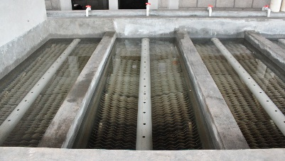

.. |N.SedTanks| replace:: **PLACEHOLDER**
.. |HL.SedLaunderOrifice| replace:: **PLACEHOLDER**
.. |Pi.QLaunderOrifices| replace:: **PLACEHOLDER**
.. |HL.SedLaunderBod| replace:: **PLACEHOLDER**
.. |B.SedLaunderOrificesEst| replace:: **PLACEHOLDER**
.. |ND.SedLaunder| replace:: **PLACEHOLDER**
.. |PS.SedLaunderStr| replace:: **PLACEHOLDER**
.. |L.SedLaunder| replace:: **PLACEHOLDER**
.. |N.SedLaunderOrifices| replace:: **PLACEHOLDER**
.. |B.SedLaunderOrifice| replace:: **PLACEHOLDER**
.. |D.SedLaunderOrifice| replace:: **PLACEHOLDER**
.. |Pi.VCOrifice| replace:: **PLACEHOLDER**

.. _title_Tubos_Recolectores:

******************
Tubos Recolectores
******************

Arriba de las placas el agua sale por los agujeros de un tubo perforado que corre a lo largo del tanque, con la fila de orificios en la parte superior. Los orificios provocan una pérdida de carga suficiente para lograr una distribución de caudal uniforme, tanto a lo largo de cada tanque como entre los |N.SedTanks| tanques. La meta es que cada recorrido del agua, entre la entrada en el canal distribuidor hasta el canal de salida, tiene una pérdida de carga parecida a los demás. Esto garantiza que los caudales en cada recorrido se parezcan también. Los |HL.SedLaunderOrifice| de pérdida de carga que provocan los orificios del tubo recolector dominan la pérdida total, y así controlan la distribución de caudal. La pérdida de carga en los orificios tiene la ventaja adicional de crear un sobrenadante sobre el tubo recolector que impide que material flotante en la superficie salga del tanque por el tubo.

El diámetro del tubo recolector se diseña como manifold para que el flujo sea constante a lo largo del tubo, que el radio del flujo mínimo al flujo máximo a través de los orificios no baje menos de |Pi.QLaunderOrifices|:

.. math::
  :label: min_max_flow_rate

    \frac{Q_{M \acute{i} n}}{Q_{M \acute{a} x}} > \Pi_Q

| Donde:
| :math:`Q_{M \acute{i} n}` = el caudal mínimo que pase por un orificio del tubo recolector
| :math:`Q_{M \acute{a} x}` = el caudal máximo que pase por un orificio del tubo recolector
| :math:`{\Pi}_Q` = el radio mínimo de caudal a través de los orificios del tubo recolector = |Pi.QLaunderOrifices|

Los orificios en el tubo recolector se diseñan para provocar aproximadamente |HL.SedLaunderBod| de pérdida de carga, tomando en cuenta el largo del tubo, una separación entre los orificios de aproximadamente |B.SedLaunderOrificesEst| y los diámetros de las brocas comúnmente disponibles. Los pasos del diseño son:

 #. Calcular el largo útil del tubo, tomando en cuenta su entrada al tanque
 #. Estimar el número de orificios con una separación estimada de |B.SedLaunderOrificesEst|
 #. Estimar el caudal por orificio dado el número de orificios estimado
 #. Calcular el diámetro querido de los orificios dado el caudal estimado por:

    .. math::
      :label: desired_diameter

        D=\sqrt{\frac{4}{\pi}\frac{Q_{Orificio}}{\mathrm{\Pi}_{VC}\sqrt{2g{HL}_{Orificio}}}}

    | Donde
    | :math:`Q_{Orificio}` = el caudal estimado por orificio
    | :math:`{\Pi}_{VC}` = el coeficiente de vena contracta para el orificio = |Pi.VCOrifice|
    | :math:`{HL}_{Orificio}` = la pérdida de carga asignada por los orificios = |HL.SedLaunderBod|
    |
    |

 #. Definir el diámetro final de los orificios según las brocas comúnmente disponibles
 #. Calcular el caudal real por orificio según el diámetro final
 #. Calcular la separación y el número final de los orificios según el caudal real por orificio

.. _table_sed_tank_tube_data:

.. csv-table:: Datos de los tubos recolectores de los tanques de sedimentación
    :align: center

    Diámetro nominal del tubo, |ND.SedLaunder| |PS.SedLaunderStr|
    Longitud de cada tubo recolector, |L.SedLaunder|
    Número de agujeros en cada tubo recolector, |N.SedLaunderOrifices|
    Separación entre agujeros, |B.SedLaunderOrifice|
    Diámetro de los agujeros, |D.SedLaunderOrifice|
    Pérdida de carga por los agujeros, |HL.SedLaunderOrifice|
