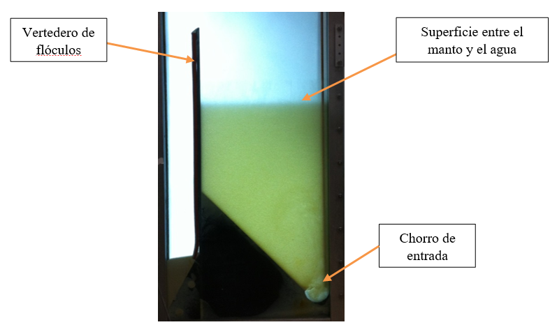

.. _title_El_Manto_de_Lodos:

*****************
El Manto de Lodos
*****************
Los tanques de sedimentación de AguaClara se diseñan con la meta de lograr otro fenómeno físico en la parte inferior del tanque que se llama el manto de lodos. Esta característica del tanque puede mejorar la calidad de agua que produce. El manto de lodos es un lecho denso de flóculos suspendidos en el agua, producto de la acumulación de sólidos captados durante tiempo. El lecho de flóculos funciona como un pre filtro. Las partículas que entran y pasan por el manto de lodos chocan con los flóculos ya suspendidas, y de esta forma las partículas más pequeñas, que quizás no se capten sin la presencia del manto de lodos, permanecen en la parte inferior del tanque. Las placas inclinadas impiden que los sólidos más pequeños salgan por arriba.

Las investigaciones del laboratorio han demostrado que se establece una superficie bien definida entre el manto de lodos y el agua más clara que sale por arriba. La suspensión de flóculos y el agua por encima se comportan como dos fluidos distintos. Se mantiene el nivel de la superficie entre el manto de lodos y el agua limpia con el **vertedero de flóculos**, una pared sobre la que los flóculos caen en una tolva cuando alcanzan la cima del vertedero. Los flóculos en el lecho se mantienen suspendidos por los chorros de entrada en el fondo del tanque.

.. _figure_sed_tank_front:

    Vista frontal del tanque de sedimentación experimental en el laboratorio de AguaClara de la Universidad de Cornell.
