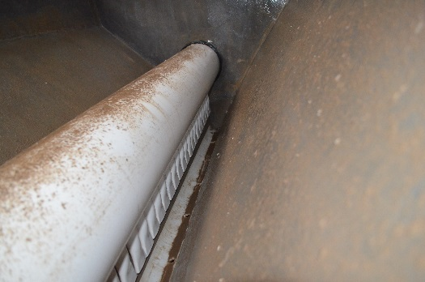

.. include:: ../global.rst

.. _title_Manifold_Distribuidor:

*********************
Manifold Distribuidor
*********************

El agua entra en cada tanque de sedimentación a través de un manifold distribuidor de |ND.SedManifold|. Los objetivos en el diseño de este tubo son:

 #. Que el agua se distribuya de manera uniforme a lo largo del tanque.
 #. Que los lodos no se sedimenten dentro del tubo.
 #. Que se cree un chorro lineal que corre a lo largo del tanque para resuspender los lodos sedimentados, así manteniendo en suspensión el manto de lodos.
 #. Que se eliminen las corrientes horizontales en el tanque, las cuales provocan una circulación que lleva el sedimento a la superficie en un extremo.
 #. Que no se quiebren los flóculos con zonas de muy alta disipación de energía en las salidas.

El agua entra en el tubo distribuidor desde el canal de entrada a través de una camisa fundida en la losa del canal. De allí baja hacia el fondo del tanque por un tubo vertical dentro de la tolva de flóculos que se conecta al tubo distribuidor horizontal por un codo de 90 grados fundido en la pendiente de la tolva.

.. _heading_difusores:

Difusores
---------

Cada agujero de salida en la parte inferior del manifold de entrada cuenta con un tubo de |ND.SedDiffuser| que dirige el chorro de agua para abajo. El extremo inferior de los tubos está estirado de tal manera que la pared del tubo pega en los dos tubos adyacentes. El resultado es un chorro lineal que corre a lo largo del tanque para re-suspender los flóculos que se sedimentan en cualquier sección transversal. Estos tubos “difusores” también tienen otro propósito - el de eliminar la velocidad horizontal del agua que sale del tubo distribuidor, así cumpliendo el quinto objetivo del diseño del tubo distribuidor listado anteriormente.

La parte horizontal del tubo distribuidor está apoyado en cada extremo de tal manera que los extremos de difusores alcanzan la altura del borde de la curva, pero que no se pegan al fondo.

.. _figure_sed_tank_bottom:

.. figure:: Images/sed_tank_bottom.png
    :width: 750px
    :align: center

    Corte transversal de la parte inferior del tanque de sedimentación.

.. _table_manifold_data:

.. csv-table:: Datos del manifold distribuidor del tanque de sedimentación
    :align: center

    Diámetro nominal del manifold, |ND.SedManifold| |PS.SedManStr|
    Diámetro de los agujeros, |D.SedManifoldPort|
    Número de agujeros y difusores, |N.SedManifoldPorts|
    Distancia entre agujeros (centro a centro), |B.SedDiffuser|
    Longitud de la parte desmontable del manifold distribuidor, |L.SedManHorizPipe2|
    Diámetro nominal de los difusores, |ND.SedDiffuser| |PS.SedDiffuserStr|
    Longitud de los difusores, |L.SedManifoldDiffuser|
    Ancho interno de la salida formada de los difusores, |W.SedDiffuserInner|
    Tasa máxima de disipación de energía en la salida de los difusores, |ED.SedInlet|
    Brecha vertical entre la orilla de la media caña y la salida de los difusores, |H.JetReverserToDiffusers|
