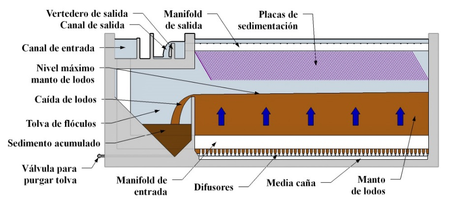
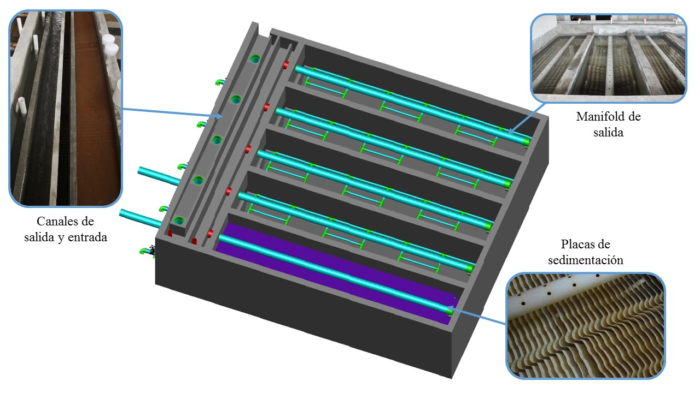
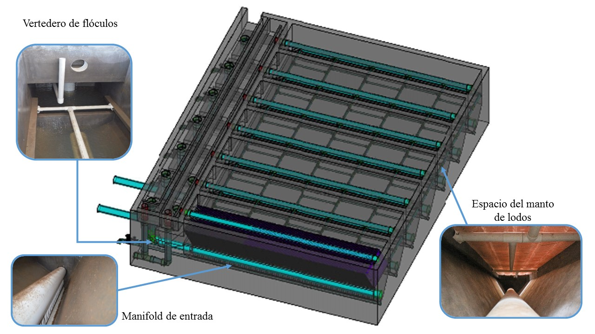

.. include:: ../global.rst

.. _title_Sed_Propósito_y_Descripción:

***********************
Propósito y Descripción
***********************

El objetivo principal de los tanques de sedimentación es quitar el sedimento del agua por la fuerza de gravedad. En este proceso el agua sube lentamente mientras las partículas suspendidas se caen y permanecen en la parte inferior del tanque. El operador purga los lodos acumulados a través de una válvula en el canal de limpieza de la planta.

.. _figure_sed_tank:

    Vista lateral de un tanque de sedimentación.

Los tanques cuentan con placas inclinadas que permiten la captura de partículas más finas. Además, los tanques están diseñados de tal manera que los lodos sedimentados no pueden permanecer en el fondo, sino que se re-suspenden para mantener un **manto de lodos** en la parte inferior. El manto de lodos es una suspensión concentrada de sedimento que mejora el rendimiento del tanque y concentra el lodo excedente.

.. _figure_sed_tank_ext:

    Los componentes exteriores de un tanque de sedimentación

.. _figure_sed_tank_int:

    Los componentes interiores de un tanque de sedimentación
