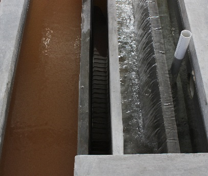

.. include:: ../global.rst

.. _title_Canales_del_Tanque_de_Sedimentación:

***********************************
Canales del Tanque de Sedimentación
***********************************

A un extremo de los tanques de sedimentación hay un sistema de canales de entrada y salida (:numref:`figure_sed_tank_channels`). Una pared que corre a lo largo de los canales los divide en dos secciones: el **canal distribuidor** (de entrada) y el **canal recolector** (de salida).

El efluente del floculador se distribuye entre los tanques de sedimentación a través del canal de entrada. Este está dividido en dos secciones por un vertedero: la primera donde están ubicadas las entradas a los tanques de sedimentación, y la segunda que sólo sirve para botar agua en el caso de una falla de tratamiento.

.. _heading_primera_sección_canal_de_entrada:

Primera sección canal de entrada
--------------------------------

La primera sección del canal se diseña para tener una velocidad máxima lo suficiente baja para mantener una distribución uniforme de flujo a los varios tanques de sedimentación. Nuevas pruebas en los laboratorios de Cornell demuestran que la rotura de los flóculos en el canal no tiene un efecto significante en el rendimiento del tanque de sedimentación. Los flóculos, aunque sean muy pequeños, con una velocidad mayor que la velocidad de captura serán capturados por las placas de sedimentación. También se diseña con una velocidad lo suficiente alta que los flóculos no se sedimentan en el canal. Otras restricciones en el dimensionamiento del canal son:

 - Tiene que ser lo suficiente ancho para los tubos que lo conectan a los tanques de sedimentación
 - Tiene que tener profundidad suficiente para apoyar los tubos recolectores de salida de los tanques de sedimentación (hay una sola losa para todos los canales)
 - No puede ser tan profundo que la construcción y el acceso se ponen difíciles

La consideración de la uniformidad de la distribución del flujo entre los tanques de sedimentación se toma en cuenta fijando la pérdida de carga máxima, :math:`\Delta H`, en este canal a no más que diez por ciento de la pérdida de carga total a través de un tanque. Con esta pérdida de carga, el ancho se calcula por:

.. math::
  :label: width_calc

    W=\frac{Q}{H-\Delta H}\sqrt{\frac{1+f\frac{L}{4R_k}}{2g\Delta H}}

| Donde
| :math:`Q` = el caudal de la planta = |Q.Plant|
| :math:`H` = el nivel máximo de agua en el canal de entrada = |HW.SedInletChannelMax|
| :math:`\Delta H` = la pérdida de carga máxima en el canal de entrada = |HL.SedInletChannelMax|
| :math:`L` = el largo del canal de entrada = |L.SedChannel|
| :math:`f` = el coeficiente de fricción para un canal rectangular*
| :math:`R_k` = el número de Reynolds para un canal rectangular*

\*Los valores de los coeficientes fluidos varían con las dimensiones del canal, entonces hay que calcular este ancho iterativamente actualizando los coeficientes hasta llegar a un valor constante de este ancho.

.. _heading_segunda_sección_canal_de_entrada:

Segunda sección canal de entrada
--------------------------------
El propósito de esta segunda sección es botar agua en el caso de una falla de tratamiento, y mantener el nivel de agua en el floculador para que se pueda recuperar la floculación sin que agua sucia salga de los tanques de sedimentación. La altura del vertedero que separa las dos secciones está justa arriba del nivel máximo de agua en la primera sección según el caudal de diseño, para que no se llene con agua sucia durante la operación normal.

.. _heading_canal_de_salida:

Canal de salida
---------------

Los tubos recolectores entregan el agua limpia a la primera sección del canal de salida. Este canal tiene otro vertedero que mantiene el nivel de agua en los tanques. Ya que el agua no está fluyendo a lo largo de la primera parte del canal, así que no hay pérdida de carga, la única restricción con respeto al ancho es que se necesita poder colocar y quitar los tapones de los tubos recolectores. En el otro lado del vertedero, el ancho se base en:

 - una pérdida de carga máxima
 - un ancho mínimo para la facilidad de construcción
 - el diámetro de la tubería que sale hacia los filtros

Todos los accesorios de PVC en rojo son desmontables, incluso los niples que tapan las entradas de las cámaras, los tapones en las salidas de los tubos recolectores, el niple que tapa el desagüe del canal de entrada, y los tapones de los tubos de limpieza de la superficie de los tanques.

.. _figure_sed_tank_channels:

.. figure:: Images/sed_tank_channels.png
    :width: 750px
    :align: center

    Canales de los tanques de sedimentación.

.. _table_channel_datar:

.. csv-table:: Datos de los canales de los tanques de sedimentación
    :align: center

    Longitud, |L.SedChannel|
    "Ancho – Entrada, primera sección (la más pegada al pasillo)", |W.SedInletChannelPreWeir|
    "Ancho – Entrada, segunda sección", |W.SedInletChannelPostWeir|
    Ancho – Entrada con las dos secciones y el vertedero, |W.SedInletChannel|
    "Ancho – Salida, primera sección (la más pegada al tanque)", |W.SedExitChannelPreWeir|
    "Ancho – Salida, segunda sección", |W.SedExitChannelPostWeir|
    Ancho – Salida con las dos secciones, |W.SedExitChannel|
    "Altura total, medida de la losa a las paredes exteriores", |H.SedInletChannel|
    Altura del vertedero – canal de entrada, |H.SedWeirInlet|
    Altura del vertedero – canal de salida, |H.SedWeirExit|
    Profundidad máxima del agua durante la operación normal – canal de entrada, 	|HW.SedInletChannel|
    Profundidad máxima del agua – canal de salida, |HW.SedExitChannel|
    Incremento de la pendiente entre cada dos entrada – canal de entrada, |H.SedIChanStep|
    "Altura total de la pendiente, medida de la losa a la parte superior", |H.SedIChanLastCoupling|
