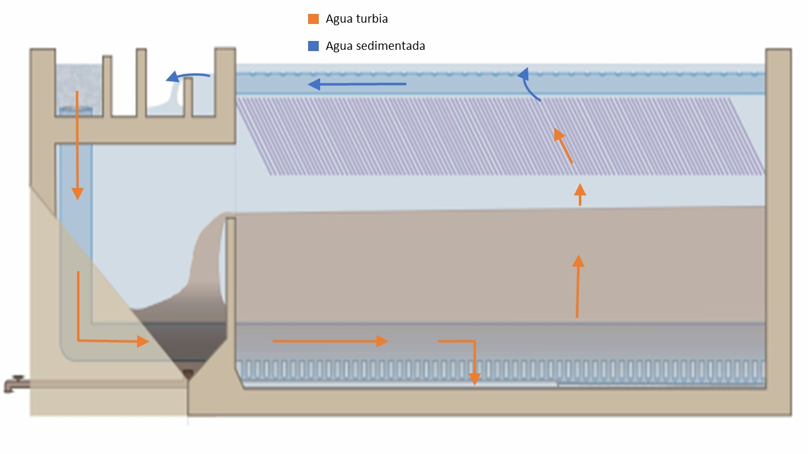
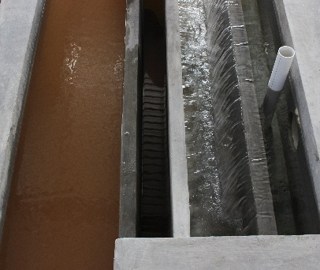
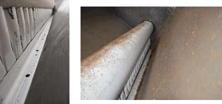
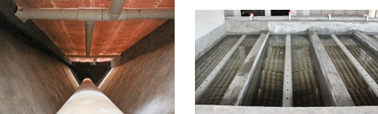

.. |N.SedTanks| replace:: **PLACEHOLDER**
.. |ND.SedManifold| replace:: **PLACEHOLDER**
.. |ND.SedDiffuser| replace:: **PLACEHOLDER**

.. _title_Recorrido_del_Agua:

******************
Recorrido del Agua
******************
.. _figure_water_path:

    El recorrido de agua en el tanque de sedimentación – vista lateral.

.. _heading_canal_distribuidor:

Canal distribuidor
------------------

Al terminar su recorrido en el floculador, el agua floculada entra en el canal distribuidor de los tanques de sedimentación. De este canal el agua se divide entre los |N.SedTanks| tanques de sedimentación. Hay un vertedero que corre a lo largo del canal que sirve para mantener el nivel de agua en el floculador cuando las entradas a los tanques de sedimentación están cerradas y se está botando agua floculada. El operador haría esto en caso de una falla de dosificación de coagulante hasta que se recupere la buena floculación, por ejemplo.

.. _heading_manifold_distribuidor_y_los_difusores:

Manifold distribuidor y los difusores
-------------------------------------

Un tubo de diámetro |ND.SedManifold|, que se llama el manifold de entrada, lleva el agua del canal distribuidor a la parte inferior de cada tanque. El agua sale del manifold por debajo a través de una serie de tubos verticales de diámetro |ND.SedDiffuser| que corre a lo largo del tanque. Los extremos inferiores de estos tubos están formados de tal manera que los chorros se unen y resulta un solo chorro de forma lineal. Este sirve para mantener el manto de lodos, re-suspendiendo todas las partículas que se sedimentan y se deslizan por las pendientes del tanque hasta la curva en el fondo.

.. _heading_manto_de lodos_placas_y_el_tubo_recolector:

Manto de lodos, placas y el tubo recolector
-------------------------------------------

Después de salir del tubo distribuidor, el agua sube lentamente por el manto de lodos y las placas hasta la parte superior del tanque. Sale del tanque, ya limpia, por los orificios del tubo recolector. El tubo recolector lleva el agua al canal de salida, que tiene otro vertedero para mantener el nivel de agua en los tanques. Después de caer por el vertedero de salida, el agua sale por los tubos que la llevan a los filtros de arena.
