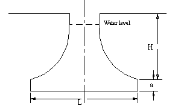
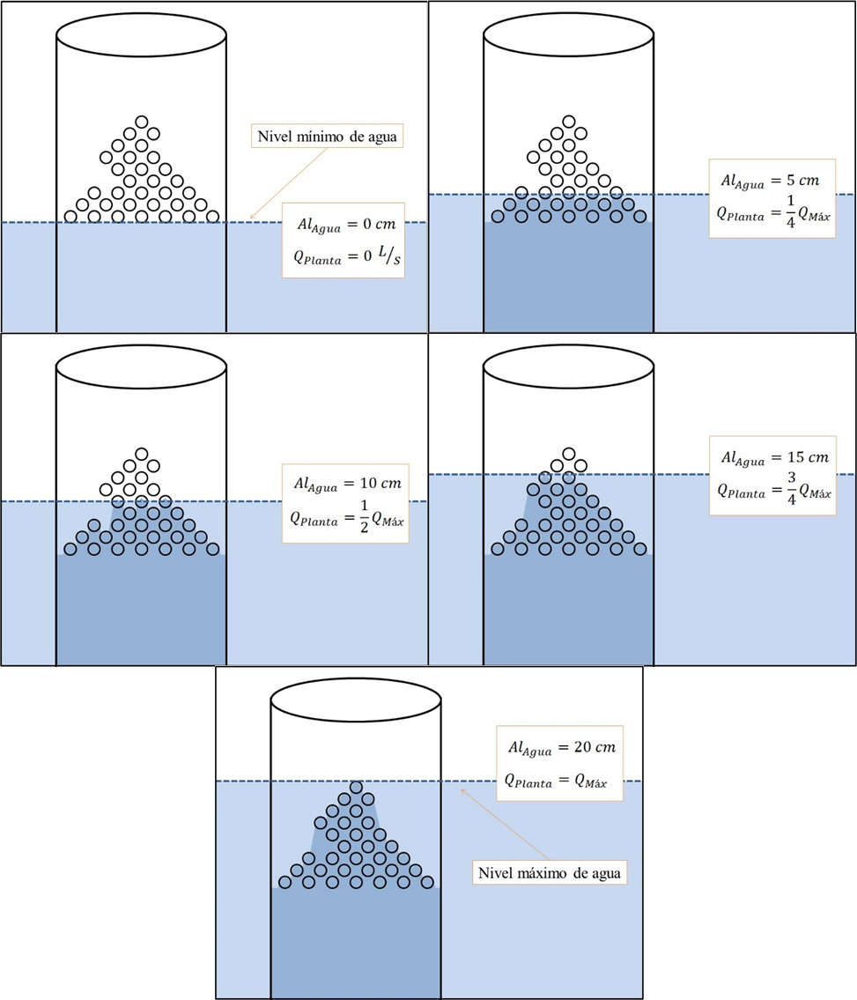

.. |W.Et| replace:: 64.1 cm
.. |N.LfomOrifices| replace:: [13.0, 3.0, 4.0, 4.0]
.. |HL.Lfom| replace:: 20.0 cm
.. |H.LfomOrifices| replace:: ['2.22 cm', '7.41 cm', '12.59 cm', '17.78 cm']
.. |D.LfomOrifices| replace:: 4.45 cm
.. |B.LfomRows| replace:: 5.0 cm

.. _title_LFOM:

*******************************
Medidor Lineal de Caudal (LFOM)
*******************************

.. _heading_el_vertedero_tipo_sutro:

El vertedero tipo Sutro
-----------------------
El vertedero tipo Sutro es una apertura que, al pasar agua de un lado al otro, mantiene una relación **lineal entre** el nivel de agua y el caudal que está pasando (Ilustración 9). En la planta AguaClara se imita la función del vertedero tipo Sutro con un diseño de orificios que crea la misma relación en la salida del tanque de entrada. El cálculo de este diseño está basado en el principio de Torricelli, el cual dice que el caudal que pasa por cada orificio sumergido es proporcional a la raíz cuadrada de la altura de agua arriba del centro del orificio:

.. math::
  :label: orifice_equation

    Q = A \sqrt{2gh}

| Donde:
| :math:`Q` = el caudal que pasa por el orifico
| :math:`A` = el área del orificio
| :math:`g` = la aceleración debida a la gravedad
| :math:`h` = la altura del agua arriba del centro del orificio

.. _figure_sutro:

    La forma de un vertedero tipo Sutro.

.. _heading_diseño_de_los_orificios:

Diseño de los orificios
-----------------------
Para diseñar el Medidor Lineal de Caudal (LFOM por sus siglas en inglés) el algoritmo de la herramienta de diseño optimiza el número de agujeros en cada fila de tal forma que el nivel cero (debajo de la primera fila de agujeros) corresponde un caudal de cero, el nivel máximo (la parte arriba de la última fila de orificios) corresponde al caudal máximo de diseño, y la relación entre el caudal y la altura de la superficie del agua entre los dos puntos es lineal.

.. _table_diseño_del_medidor_lineal_de_caudal:

.. csv-table:: Diseño del medidor lineal de caudal
  :widths: 50, 10
  :align: center

  "Rango de niveles de agua (distancia vertical entre el nivel cero y el nivel máximo)", |HL.Lfom|
  "Diámetro de los agujeros", |D.LfomOrifices|
  "Separación entre las filas de agujeros (centro a centro)", |B.LfomRows|
  "Número de agujeros en cada fila, empezando con la fila inferior",	|N.LfomOrifices|
  "Altura de cada fila arriba del nivel cero, empezando con la fila inferior", |H.LfomOrifices|

Con el medidor de caudal lineal de 20cm, cada incremento en el caudal provoca el mismo incremento en el nivel de agua en el tanque de entrada.

.. _figure_lfom20:

    Funcionamiento de un medidor lineal de caudal (LFOM) de 20 cm.
