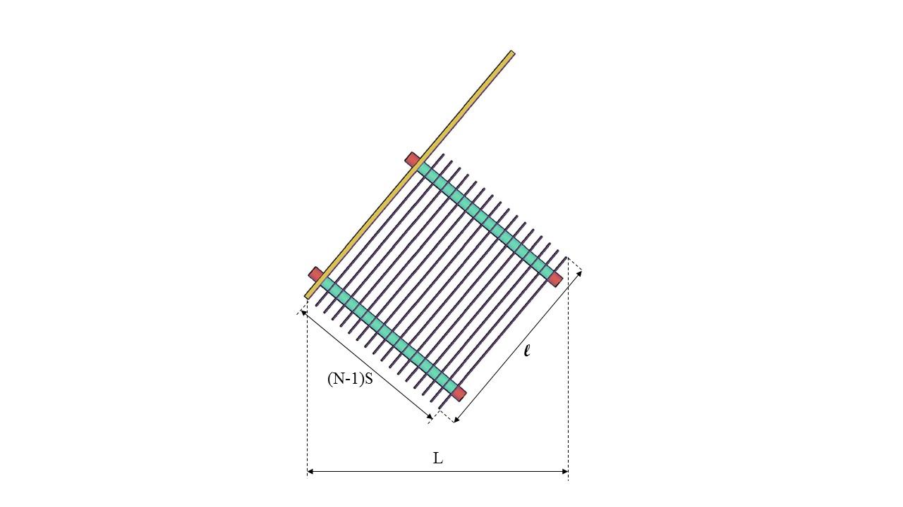

.. |W.Et| replace:: 64.1 cm
.. |N.LfomOrifices| replace:: [13.0, 3.0, 4.0, 4.0]
.. |HL.Lfom| replace:: 20.0 cm
.. |H.LfomOrifices| replace:: ['2.22 cm', '7.41 cm', '12.59 cm', '17.78 cm']
.. |D.LfomOrifices| replace:: 4.45 cm
.. |B.LfomRows| replace:: 5.0 cm

.. _title_Tank_Algoritmo_de_Diseño:

*******************
Algoritmo de Diseño
*******************

.. _heading_placas_de_sedimentación:

Placas de sedimentación
-----------------------
El número de placas de sedimentación necesario para lograr la velocidad de captura de diseño está relacionado con la longitud de las placas. Al incrementar la longitud, se necesitan menos placas. La longitud total del módulo de placas,

.. _figure_plate_module:

    Vista lateral del módulo de placas. La longitud total :math:`L` del módulo depende tanto del número de placas :math:`N` como de la longitud de las placas :math:`\ell`. Ya que se puede compensar el efecto de menos placas con placas más largas hay un número óptimo para minimizar la longitud total.

.. math::
  :label: number_of_plates

    N = ceil\left(\sqrt{\frac{Q}{\left(S+T\right)WV_{C}\sin {\alpha}}}\right)

| Donde:
| :math:`N` = el número de placas = |N.EtPlates|
| La función :math:`ceil\left(x\right)` redondea el valor :math:`x` para arriba al número entero más cercano
| :math:`Q` = el caudal de diseño
| :math:`S` = la separación perpendicular entre las placas = |S.EtPlate|
| :math:`T` = el grosor de las placas = |T.EtPlate|
| :math:`W` = el ancho del tanque = |W.Et|
| :math:`V_{C}` = la velocidad de captura de diseño = |V.EtCaptureBod|
| :math:`\alpha` = el ángulo de inclinación de las placas = |AN.EtPlate|

La longitud de las placas que corresponde al número óptimo se encuentra por:

.. math::
  :label: plate_length

    L=Ceil\left(\frac{Q}{NWV_C\cos{\alpha}}-S\tan{\alpha},10cm\right)

| Donde:
| :math:`L` = la longitud de las placas = |L.EtPlate|
| La función :math:`Ceil\left(x,10cm\right)` redondea el valor :math:`x` para arriba al múltiple de 10cm más cercano

Se redondea la longitud de las placas para arriba al múltiple de 10cm más cercano para 1) facilitar la fabricación del módulo de placas y 2) producir un diseño conservador con respecto a la velocidad de captura, para compensar cualquier ineficiencia debida a la distribución de caudal entre las placas.
