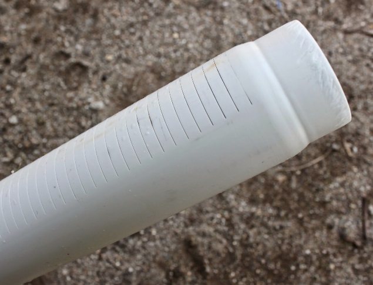
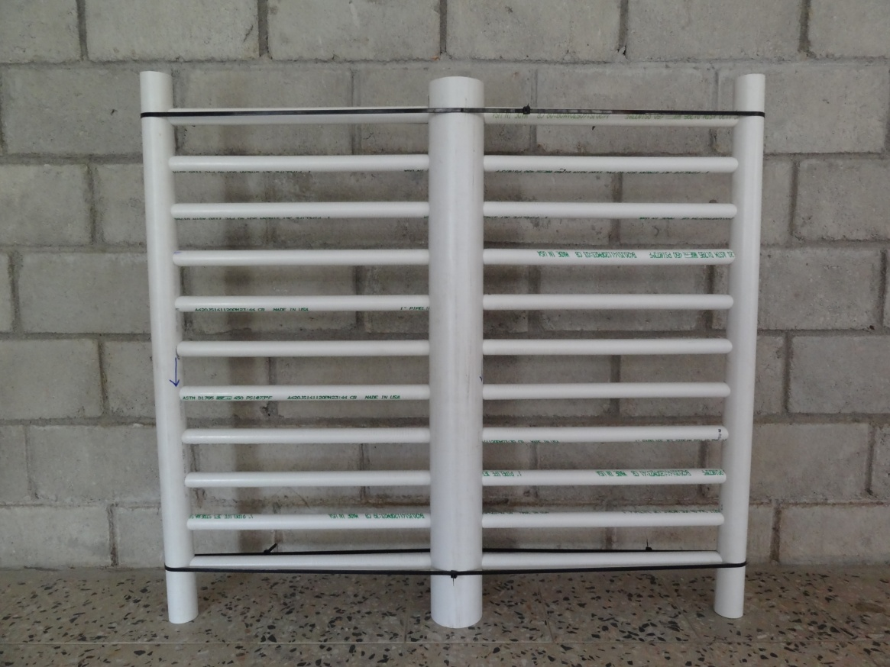

.. include:: ../global.rst

.. _title_Manifolds de Salida:

*******************
Manifolds de Salida
*******************

A diferencia de los manifolds de entrada, los manifolds de salida cuentan con tubos ranurados en vez de tubos perforados para los ramales. Las ranuras tienen |W.FiManSlots| de ancho, de tal manera que el agua puede entrar en el tubo pero la arena no.

.. _figure_exit_manifold_grooves:

    Las ranuras de un ramal del manifold de salida.

.. _figure_exit_manifold:

    El manifold de salida con los tubos ranurados.

El área colectiva de las ranuras por manifold es el doble del área colectiva de los orificios en el manifold de retrolavado, porque estos manifolds de salida extraen el agua de dos capas de arena cada uno. El largo de las ranuras se define para lograr el área colectiva querida:

.. math::
    :label: goove_length

    L_{Ranura}=\frac{A_{Capa}\bullet S_{Ranura}}{W_{Ranura}\bullet N_{Ramal}\bullet L_{Ramal}\bullet N_{Filas}}

| Donde
| :math:`A_{Capa}` = el área colectiva querida = |A.FiOutletManSlots|
| :math:`S_{Ranura}` = la separación de las ranuras = |B.FiManSlot|
| :math:`W_{Ranura}` = el ancho de las ranuras = |W.FiManSlots|
| :math:`N_{Ramal}` = el número de ramales por manifold = |N.FiManBranch|
| :math:`L_{Ramal}` = el largo ranurado del ramal = |L.FiOutletBranchSlotted|
| :math:`N_{Filas}` = el número de filas de ranuras por ramal = |N.FiSlotRows| (significa que ambos lados tienen ranuras)

La pérdida de carga a través de las ranuras durante la filtración normal es dada por:

.. math::
    :label: goove_head_loss

    {HL}_{Orificio}=\frac{\left(\frac{Q_{Capa}}{A_{Capa}\Pi_{VC}\varepsilon_{Arena}}\right)^2}{2g}

| Donde
| :math:`Q_{Capa}` = el caudal de agua que sale por el manifold
| :math:`A_{Capa}` = el área colectiva de las ranuras en el manifold
| :math:`\Pi _{VC}` = el coeficiente de vena contracta para un orificio = |Pi.VCOrifice|
| :math:`\varepsilon_{Arena}` = la porosidad del lecho de arena = |ε.FiSand|

.. _table_exit_manifold_data:

.. csv-table:: Datos de los manifolds de salida
    :align: center

    Líneas troncales de los manifolds, |ND.FiTrunk| |PS.FiTrunkStr|
    Ramales de salida superiores, |ND.FiManBranch| |PS.FiBranchStr|
    Número de ramales en cada manifold de salida, |N.FiManBranch|
    Longitud de los ramales, |L.FiManBranch|
    Longitud de la parte del ramal que entra en los orificios del tronco y el tubo que recibe el ramal en el otro extremo, |L.FiManBranchExt|
    Longitud de la parte ranurada de cada ramal, |L.FiOutletBranchSlotted|
    Número de filas de ranuras en cada ramal, |N.FiSlotRows|
    Separación entre ranuras, |B.FiManSlot|
    Número de ranuras en cada fila, |N.FiOutletManSlotsPerRow|
    Número de ranuras en cada ramal, |N.FiOutletManSlotsPerBranch|
    Ancho de las ranuras, |W.FiManSlots|
    "Longitud interior de las ranuras, medida en la curva del tubo", |L.FiOutletManSlotCurvedInner|
