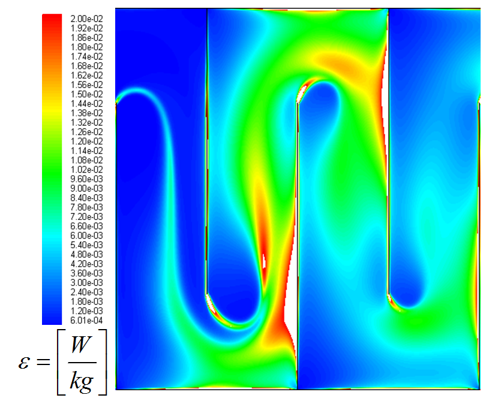

.. _title_Conceptos_de_Diseño_del_Floculador:

**********************************
Conceptos de Diseño del Floculador
**********************************

.. _heading_El_potencial_de_colisiones_y el_rendimiento_del_floculador:

El potencial de colisiones y el rendimiento del floculador
----------------------------------------------------------

Empezamos con energía potencial que se puede ver por el desnivel entre aguas arriba y aguas abajo en el floculador. Este energía potencial convierte a energía cinética en las contracciones del flujo aguas abajo de cambios de direction o de restricciones.  Luego los chorros que salen de las contracciones se deshacen en remolinos. La tasa de convertir energía mecánica a hacer remolinos y luego hacer calor es

.. math::
  :label: EDR_of_headloss

  \bar \varepsilon \theta = g h_L

donde :math:`\bar \varepsilon \theta` es la energía mecánica que se convierte a calor en el floculador y :math:`g h_L` es la energía potencial que se pierde a calor en el floculador. En el proceso de convertir la energía de los remolinos a calor el agua se deforma. La tasa de deformación del fluido es la gradiente de velocidad, G. La tasa de la disipación de energía está relacionada al gradiente de velocidad por la fórmula:

.. math::
  :label: EDR_of_G

  \bar \varepsilon=\nu G_{CS}^2

Donde :math:`\nu` es la viscosidad cinemática del agua y :math:`G_{CS}` es la gradiente de velocidad definido de Camp y Stein (1955)

Para reducir la concentración de partículas primerias que no han combinado con otras partículas tenemos que dar un cierto cantidad de deformación del agua. La cantidad de deformación del agua es lo que da las colisiones entre las partículas y por eso el potencial de colisiones es el producto de el tiempo de retención :math:`\theta` y el gradiente de velocidad, :math:`G_{CS}`, de Camp y Stein (1955).

El modelo de floculación de AguaClara da la forma de la relación entre el potencial de colisiones y la concentración de partículas primerias que no han floculado.

.. math::
   :label: Gtlam

	 G_{CS}\theta = \frac{3}{2}\frac{{\left( {{\bar \Lambda ^2} - \bar \Lambda_0^2} \right)}}{{k\pi\bar{\alpha} \bar{d}_P^2}}

donde :math:`\bar \Lambda_0` es la distancia entre partículas primeras en el agua cruda, :math:`\bar \Lambda` es la distancia entre partículas primeras saliendo del floculador, :math:`\bar{\alpha}` es la probabilidad que el punto de colisión entre dos partículas primerias sea en una partícula nano de coagulante, :math:`\bar{d}_P` es el diámetro de las partículas primerias, y :math:`k` representa la fracción de partículas primerias que conviertan a un floculo con una velocidad de sedimentación terminal mayor que la velocidad de captura de las placas de sedimentación. Ecuación :eq:`Gtlam` muestra que para lograr una baja concentración de partículas primerias en la salida del floculador, una alta :math:`\bar \Lambda`, es necesario diseñar un floculador con alta potencia de colisiones, :math:`G_{CS}\theta`.

El potencial de colisiones, :math:`G_{CS}\theta`, es una propiedad del floculador en sí, independiente de las características del agua cruda, la dosis de coagulante, y el diseño del proceso de sedimentación. Se diseña el floculador de la planta AguaClara con un potencial de colisiones mínimo de |Gt.FlocBod|, el cual ha sido exitoso en las plantas que tiene manto de lodo.

Sin embargo, a diferencia de algunas metodologías convencionales, en el diseño del floculador de AguaClara no se considera ninguna característica del agua cruda aparte de la necesidad general de los procesos de floculación, manto de lodo, y sedimentación para la remoción de sólidos suspendidos. Es decir, el diseño es independiente de los resultados de pruebas de jarra u otros análisis preliminares porque la prueba de jarra no puede capturar el proceso clave del manto de lodo. Los únicos factores del modelo predictivo que se toman en cuenta en el diseño son los relacionados al potencial de colisiones y el efecto de la viscosidad del agua. En lugar de conocer las características del agua cruda, el objetivo es diseñar un floculador que pueda flocular efectivamente cualquier suspensión con cobertura suficiente de coagulante. Por eso la herramienta de diseño no pide ninguna entrada del usuario relacionada a las pruebas de tratabilidad. El agua cruda sólo entra en el diseño de los dosificadores del coagulante y cloro donde la demanda de estos dos químicos en los momentos más críticos determina la dosis máxima.

Se ha formulado el diseño de AguaClara para que sea independiente del agua cruda por dos razones principales:

 #. Los resultados de las pruebas de jarra pueden ser útiles para determinar la eficiencia de la coagulación variando la dosis de coagulante, pero normalmente no se aplican a la floculación de escala real por las diferencias fundamentales en los procesos, tal como la gran variedad de gradientes de velocidad locales en los reactores con agitadores y la falta del proceso de manto de lodo en la prueba de jarra.
 #. Las características del agua cruda siempre varían con el tiempo, y en muchos casos es difícil obtener un juego representativo de datos dentro del tiempo y el presupuesto disponibles para el estudio y diseño de la planta. Una de las metas principales de AguaClara es brindar soluciones efectivas bajando costos y tiempos lo más posible para poder servir al máximo número de personas.

El diseño toma en cuenta el proceso de filtración que sucede en el manto de lodo en el tanque de sedimentación. El manto de lodo es una suspensión de flóculos que se mantiene en la parte inferior del tanque de sedimentación y que provee la oportunidad para colisiones entre partículas causadas por la sedimentación diferencial. Por el trabajo que hace el manto de lodo, las plantas AguaClara logran bajo niveles de turbidez en el agua decantada aun que usan una floculador con bajo potencial de colisiones.

.. _heading_Eficiencia del floculador:

Eficiencia del floculador
-------------------------

La eficiencia de conversion de energía potencial a deformación del agua depende en la uniformidad de la tasa de disipación de energía. Si hay espacios con alta turbulencia y otros espacio con poca turbulencia la deformación total del fluido va a ser mucho menor que si hubiese logrado una turbulencia uniforme dado la misma energía. Floculadores mecanizadas y también muchos floculadores hidráulicos convencionales hacen falta de considerar el impacto de falta de uniformidad espacial de turbulencia. Por ejemplo, la tasa de disipación de energía es mucho más alta que la tasa promedio atrás de las aspas ladeadas del hélice. Por eso no tiene sentido ni comparar la potencial de colisiones calculado por :math:`G_{CS}\theta` entre floculadores mecanizadas y floculadores que son diseñadas para optimizar la uniformidad de la tasa de disipación de energía.

La expansión del chorro provocada por la vuelta alrededor de un deflector ocupa solamente una parte del espacio entre las siguientes láminas (:numref:`figure_floc_energy_dissipation`). Esta expansión es donde se encuentra la turbulencia que al fin causa la deformación del agua y las velocidades relativas que juntan las partículas suspendidas. Dentro del chorro hay regiones de alta disipación de energía, la cual indica turbulencia violenta y altas velocidades relativas, y hay también zonas de turbulencia más suave. De igual manera hay regiones del flujo que contribuyen muy poco a la floculación porque están fuera de la expansión del chorro. Si la tasa de la disipación de energía fuera uniforme sería un floculador ideal, con turbulencia uniforme y todo el volumen contribuyendo igualmente a la unión de partículas.

.. _figure_floc_energy_dissipation:

    Distribución de la tasa de la disipación de energía en un floculador según análisis de CFD.

La geometría de los deflectores determina la uniformidad de la disipación de energía. En particular, el radio de la longitud de la expansión del chorro a la separación entre los deflectores (H/S) está relacionado directamente a la uniformidad de la expansión. Es decir, este radio determina la eficiencia del floculador en cuanto al porcentaje del espacio que contribuye a la unión de partículas. Si el espacio para la expansión es muy largo comparado con la separación entre los deflectores, la expansión del chorro se termina en la primera parte del espacio disponible y se desperdicia una gran parte del volumen del floculador (:numref:`figure_energy_dissipation_uniformity`).

.. _figure_energy_dissipation_uniformity:

.. figure:: Images/energy_dissipation_uniformity.png
    :width: 200px
    :align: center

    El radio de la longitud de la expansión a la separación entre deflectores (H/S) determina la uniformidad espacial de la disipación de energía.

Según una serie de análisis de CFD, el rango óptimo del radio H/S está entre |Pi.HSMin| y |Pi.HSTransition|. Aquí el radio :math:`\frac{\varepsilon_{max}}{\bar \varepsilon}` es igual a 2. Arriba del rango óptimo la uniformidad de la turbulencia se deteriora.

Las restricciones constructivas para caudales menores requieren un radio H/S demasiado alto para un diseño eficiente. La altura mínima de los canales se determinaba por la altura del tanque de sedimentación adyacente, y el ancho mínimo de los canales se determinaba por el espacio necesario durante la construcción. Por el ancho del canal la separación entre deflectores tenía que ser menor para alcanzar la gradiente de velocidad requerida. Por simplicidad de fabricación, sólo había una expansión entre cada dos láminas. Especialmente para caudales menores, el resultado de estas restricciones era un radio H/S muy arriba del rango óptimo. Había que compensar con un floculador más grande para cumplir el objetivo del potencial de colisiones.

Ahora se diseña el floculador con obstáculos adicionales entre las láminas que provocan expansiones adicionales. De esta manera se reduce la longitud del espacio después de cada expansión y se puede mantener el radio H/S dentro del rango óptimo. Los obstáculos son dos pedazos de tubo de PVC entre los cuales el agua tiene que fluir, causando una contracción igual a la contracción que ocurre después de la vuelta alrededor de un deflector.

.. _heading_La_tasa_máxima_de_la_disipación_de_energía:

La tasa máxima de la disipación de energía
------------------------------------------

No es el tamaño máximo de los flóculos que realmente determina la calidad de agua sedimentada, sino el número de partículas primarias que no han floculado al alcanzar el fin del proceso. Por ejemplo, los flóculos más grandes, si se dividen en dos por la fuerza cortante del flujo, siempre se captarán en el tanque de sedimentación, ya que la velocidad de captura es mucho menos que la velocidad de sedimentación de estos flóculos. Las partículas que constituyen la turbiedad del efluente son mucho más pequeñas, y es probable que su origen se deba a la falta de cobertura del coagulante, no a la alta disipación de energía.

En varias simulaciones de laboratorio en que se variaron el tiempo de retención y el gradiente de velocidad en un floculador de flujo laminar, los datos preliminares sugieren que se puede compensar una reducción en el tiempo de retención con un aumento en el gradiente de velocidad (así manteniendo constante el potencial de colisiones) para producir el mismo resultado con respecto a la calidad de agua sedimentada. Es cierto que al aumentar el gradiente de velocidad se limita el tamaño máximo de los flóculos. Entonces, este resultado sugiere que el tamaño máximo de los flóculos no es crítico para el rendimiento del sistema de tratamiento especialmente cuando incluye un manto de lodo donde los flóculos siguen creciendo.

Al final, los flóculos serán sometidos a una tasa de la disipación de energía de |ED.SedInlet| en la entrada al tanque de sedimentación para causar |HL.SedDiffuser| de pérdida de carga y así mantener la distribución de caudal uniforme a lo largo del manifold y lograr suspender los flóculos que reposaron en el fondo del tanque de sedimentación. Los datos de la simulación de laboratorio que se hizo para probar este diseño sugieren que no se disminuye la calidad de agua sedimentada hasta que la tasa de la disipación de energía en la entrada al tanque supera 300 mW/kg lo cual es equivalente a una gradiente de velocidad de 550 Hz. Dado que el tamaño máximo de los flóculos será limitado por la entrada al tanque de sedimentación, es claro que no es necesario diseñar un floculador para producir flóculos grandes que después se van a romper.

Dado que el gradiente de velocidad en la entrada del tanque de sedimentación es mas alta que el gradiente de velocidad que se usan en el floculador no es necesario ni conveniente usar una seria de gradientes declinantes en el floculador. Es mas sencillo y mas eficiente usar una sola gradiente para todo el floculador para obtener el máximo potencial de colisiones usando el menor cantidad de energía.

.. _heading_Las_dimensiones_del_floculador_y_la_gradiente_de_velocidad:

Las dimensiones del floculador y la gradiente de velocidad
----------------------------------------------------------

El diseño comienza con el potencial de colisiones,  |Gt.FlocBod|, y la perdida de carga disponible para el floculador, |HL.FlocBod|. Con la combinación de ecuación :eq:`EDR_of_G` y ecuación :eq:`EDR_of_headloss` se obtiene una relación entre perdida de carga y gradiente de velocidad.

.. math::
   :label: GofHLtheta

   G_{CS} = \sqrt{\frac{g h_L}{\nu \theta}}

:math:`G_{CS}` y :math:`\theta` son desconocidos todavia pero sabemos el valor de :math:`G_{CS}\theta` y por eso se puede eliminar :math:`\theta` de la ecuación :eq:`GofHLtheta`

.. math::
   :label: GofHL

   G_{CS} = \frac{g h_{L_{floc}}}{\nu (G_{CS} \theta)}

El valor de :math:`G_{CS}` es |G.Floc| y se puede combinar eso con la potencial de colisiones :math:`G_{CS}\theta` para obtener el valor del tiempo de retención del floculador. El volumen del floculador sin tomar en cuenta el desnivel del agua sería

.. math::
   :label: Floc_volume

   \rlap{--} V_{floc} = \frac{\theta}{Q}

Para calcular el espacio entre placas usamos el valor de :math:`G_{CS}`, |G.Floc|, y consideramos el diseño de una expansion. Para los próximos pasos, consideramos el flujo por un expansión en el floculador. La distancia entre expansions, :math:`H_e`, tiene un valor de |He.Floc|. El tiempo de retención de una expansion es :math:`\theta_e` y la perdida de carga para una expansion es :math:`h_{L_{e}}`.

Comenzamos igualando la tasa de disipación de energía, :math:`\bar \varepsilon = \nu G_{CS}^2` y
:math:`\bar \varepsilon = \frac{g h_{L_e}}{\theta_e}` para obtener una ecuación en base de :math:`G_{CS}`.

.. math::
   :label: G_of_HL

    \nu G_{CS}^2 = \frac{g h_{L_e}}{\theta_e}

Podemos usar tres relaciones para calcular el espacio entre placas usando ecuación :eq:`G_of_HL`.

 #. Perdidas menores: :math:`h_{L_{e}} = K \frac{\bar v^2}{2g}`
 #. Tiempo de retencion en una expansion: :math:`\theta_e = \frac{H_e}{\bar v}`
 #. Velocidad media en el floculador: :math:`\bar v = \frac{Q}{WS}`

Sustituyendo los tres relaciones en ecuación :eq:`G_of_HL` empezando con la eliminación de la perdida de carga.

.. math::
   :label: G_of_Ktheta

   \nu G_{CS}^2 = K \frac{\bar v^2}{2 \theta_e}

Eliminar el tiempo de retención.

.. math::
   :label: G_of_KHev

   \nu G_{CS}^2 = K \frac{\bar v^3}{2 H_e}

Eliminar la velocidad.

.. math::
   :label: G_of_KHeQ

   \nu G_{CS}^2 = \frac{K}{2 H_e} \left( \frac{Q}{WS} \right)^3

Dado el ancho del canal, |W.FlocChannel|, en este diseño podemos calcular el espacio entre placas.

.. math::
   :label: S_of_KHeQ

   S = \frac{Q}{W}\left( \frac{K}{2 H_e \nu G_{CS}^2} \right)^\frac{1}{3}

| Donde:
| :math:`W` = el ancho del canal de floculación
| :math:`K` = coeficiente de la pérdida de carga para la vuelta alrededor de un deflector = |K.FlocBaffle|
| :math:`\theta _e` = tiempo de retención en una expansión
| :math:`H_e` = longitud de la expansión del chorro después de un deflector, antes de la siguiente contracción

.. _heading_Bibliografía:

Bibliografía
------------

Cleasby, J., 1984. Is velocity gradient a valid turbulent flocculation
parameter? J. Environ. Eng. 110 (5), 875e897.

Swetland, K., Weber-Shirk, M., and Lion, L. (2014). ”Flocculation-Sedimentation
Performance Model for Laminar-Flow Hydraulic Flocculation with Polyaluminum
Chloride and Aluminum Sulfate Coagulants.” J. Environ. Eng., 140(3), 04014002.

Weber-Shirk, M. L., Lion, L. W., 2010. Flocculation model and collision
potential for reactors with flows characterized by high peclet numbers. Water
Res. 44 (18), 5180-5187.
