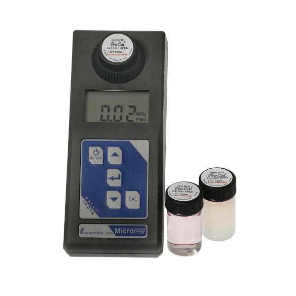

.. _title_Necesidades_para_Operar_una_Planta_AguaClara:

********************************************
Necesidades para Operar una Planta AguaClara
********************************************

.. _heading_personal_e_insumos:

Personal e insumos
------------------
 - Operador capacitado en el manejo de la tecnología AguaClara presente siempre cuando la planta está funcionando, las 24 horas en la mayoría de los casos.
 - Dosis adecuada y constante de un químico coagulante (sulfato de aluminio o policloruro de aluminio) para la remoción de turbiedad.
 - Dosis adecuada y constante de hipoclorito de calcio (cloro) para la desinfección.

.. _heading_equipo_básico_de_laboratorio:

Equipo básico de laboratorio
----------------------------
 - Un turbidímetro portátil, la herramienta más fundamental para la operación de la planta (:numref:`figure_microtpi`). Este instrumento se usa para medir la cantidad de sedimento que trae el afluente a la planta para elegir la dosis de coagulante, para evaluar el rendimiento de cada proceso con medidas de su efluente, y para registrar la calidad de agua que la planta produce durante el día. En las plantas AguaClara existentes se ha usado el MicroTPI turbidímetro portátil con luz infrarroja de HF Scientific con un rango efectivo de 0.02 UTN a 1100 UTN.
 - El kit de calibración del turbidímetro para asegurar mediciones precisas.
 - Comparador de cloro para comprobar con regularidad que la concentración de cloro libre residual está dentro del rango aceptable en la red de distribución.
 - Probetas para medir volúmenes pequeños de líquidos, especialmente para pruebas del sistema de dosificación de químicos.
 - Una escala para medir las masas de químicos en polvo para la preparación de las soluciones madres del coagulante y cloro.
 - Un cronómetro para medir caudales de agua y químicos.

.. _figure_microtpi:

    El MicroTPI turbidímetro de HF Scientific.
