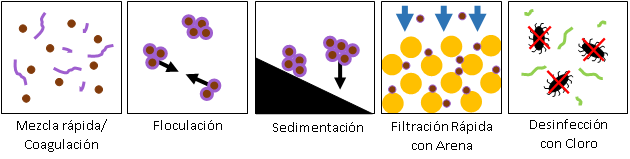

.. _title_Procesos_de_Tratamiento:

***********************
Procesos de Tratamiento
***********************
Las plantas producen agua limpia y segura, tras la remoción de sedimentos y patógenos. La tecnología AguaClara emplea los procesos unitarios de coagulación, floculación, sedimentación, filtración rápida con arena, y desinfección con cloro (:numref:`figure_process`).

.. _figure_process:

    Los procesos de tratamiento que se utilizan en la planta AguaClara.

.. _heading_el_tanque_de_entrada:

El tanque de entrada
--------------------
El proceso inicia en el **tanque de entrada**, que sirve tanto para quitar del agua el material grueso como para medir el caudal de agua para la dosificación de los químicos. El tanque de entrada funciona como tanque de sedimentación en que las partículas gruesas se caen al fondo del tanque por gravedad. Debido al diseño especial de la salida, el nivel de agua en el tanque varía en proporción al caudal de agua en la planta. Este nivel de agua está conectado con el sistema semi-automático de dosificación de químicos, de tal forma que las dosis del coagulante y del cloro se mantienen aun cuando cambia el caudal de agua en la planta. Mediante el dosificador de químicos, en la salida del tanque de entrada se aplica un coagulante, que se une con el agua cruda en la **mezcla rápida**.

.. _heading_mezcla_rápida:

Mezcla rápida
-------------
La mezcla rápida distribuye uniformemente el coagulante en el agua cruda. Es simplemente un orificio, más angosto que el tubo que transmite el agua. Cuando el flujo vuelve a expandirse después del orificio la turbulencia de la expansión es suficiente para distribuir el químico. Con la mezcla del químico con el agua comienza el proceso de **coagulación**, en que las partículas finas suspendidas, denominadas coloides, se cubren con nanopartículas del coagulante. En efecto, las nanopartículas del coagulante actúan como pegamento de tal manera que cuando las partículas, sean de arcilla o sean patógenas, se chocan entre sí ya no se repelan, sino que se quedan pegadas.

.. _heading_floculación:

Floculación
-----------
Luego la mezcla de agua y coagulante entra en el **floculador**, una serie de canales con deflectores que dirigen el flujo de agua. La mezcla suave en el flujo del floculador promueve choques entre partículas, y estas se quedan pegadas por el efecto de las nanopartículas del coagulante. Durante este proceso, que se llama la floculación, las partículas crecen, formando aglomeraciones (**flóculos**). Al final han alcanzado un tamaño visible, y tienen una velocidad terminal suficiente alta para eliminarse en el siguiente proceso, la **sedimentación**.

.. _heading_sedimentación:

Sedimentación
-------------
El **tanque de sedimentación** elimina la mayoría de las partículas suspendidas aprovechando tres procesos. Empieza con el manto de lodo lo cual es un lecho fluidizado de flóculos que funcionan como un filtro para atrapar partículas pequeñas. Los flóculos sobrantes pasan por un vertedero para acumular en una tolva donde se puedan concentrar y salir al canal de desagüe. Arriba del manto del lodo hay una serie de láminas inclinadas. Estas placas de sedimentación permiten la captura de partículas con una baja velocidad terminal. El agua sedimentada sale del tanque arriba de las placas a través de un tubo perforado.

.. _heading_manto_de_lodos:

Manto de lodos
--------------
En la parte inferior, donde entra el agua floculada, los tanques de sedimentación cuentan con instalaciones que mantienen un **manto de lodos**, un lecho denso de flóculos suspendidos. El agua que entra en el tanque tiene que pasar primero por el manto de lodos antes de alcanzar las placas arriba. Los flóculos suspendidos en efecto sirven como filtro para captar las partículas más finas, que de otra manera pasarían el proceso de sedimentación. Los chorros de agua que entran en el tanque levantan los lodos que se han sedimentado, manteniéndolos en suspensión.

.. _heading_filtración_con_arena:

Filtración con arena
--------------------
Después de sedimentación, la planta utiliza la **filtración rápida con arena** en forma del FRAMCA (Filtro Rápido de Arena en Múltiples Capas Abierto) de AguaClara. El proceso consiste en pasar el agua sedimentada por un lecho de arena donde se captan las partículas suspendidas. Sirve para bajar aún más la turbiedad y para captar cualquier parásito que permanezca después de sedimentación. Es necesario retrolavar el filtro con regularidad para eliminar el sedimento acumulado en la arena. El FRAMCA de AguaClara está diseñado para hacer el ciclo de retrolavado sin ninguna bomba. El diseño en capas reduce el área necesitada para la construcción comparado con otros sistemas de filtros rápidos y reduce la cantidad de agua que se utilice para el retrolavado.

.. _heading_desinfección:

Desinfección
------------
Antes de distribuirse, el agua se **desinfecta** con cloro para inactivar cualquier microorganismo nocivo que permanezca. La solución de hipoclorito de calcio se dosifica utilizando el mismo sistema que se usa para el coagulante, ubicado en el tanque de entrada, y se transmite por un tubo de PVC hasta la salida de la planta. Este último paso se realiza después de la remoción de los sólidos suspendidos porque la desinfección no funciona con agua sucia por la intervención de las partículas y los materiales orgánicos. El cloro también sirve para proteger contra la contaminación en la red de distribución y en las casas. Por tanto, la dosis debe ser suficiente para mantener un residuo en la última conexión del sistema de agua.
