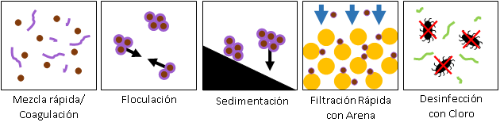

.. _title_Procesos_de_Tratamiento:

***********************
Procesos de Tratamiento
***********************
Las plantas producen agua limpia y segura, tras la remoción de sedimentos y patógenos. La tecnología AguaClara emplea los procesos unitarios de coagulación, floculación, sedimentación, filtración rápida con arena, y desinfección con cloro (:numref:`figure_process`).

.. _figure_process:

    Los procesos de tratamiento que se utilizan en la planta AguaClara.

.. _heading_sedimentación:

Sedimentación
-------------
El **tanque de sedimentación** elimina la mayoría de las partículas suspendidas aprovechando tres procesos. Empieza con el manto de lodo lo cual es un lecho fluidizado de flóculos que funcionan como un filtro para atrapar partículas pequeñas. Los flóculos sobrantes pasan por un vertedero para acumular en una tolva donde se puedan concentrar y salir al canal de desagüe. Arriba del manto del lodo hay una serie de láminas inclinadas. Estas placas de sedimentación permiten la captura de partículas con una baja velocidad terminal. El agua sedimentada sale del tanque arriba de las placas a través de un tubo perforado.
