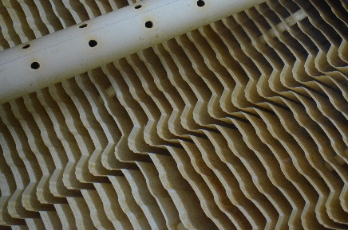
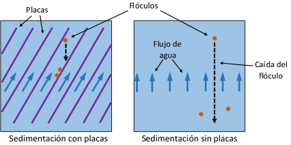

.. include:: ../global.rst

.. _title_Placas_de_Sedimentación:

***********************
Placas de Sedimentación
***********************

Los módulos de placas se montan en la parte superior de los tanques de sedimentación para reducir el tamaño de las partículas más pequeñas que se pueden capturar. Aumentan el área de la superficie en la que las partículas pueden pegar y ser captadas. Es decir, las placas reducen la distancia que una partícula suspendida entre ellas tiene que caerse antes de pegar en una superficie sólida (:numref:`figure_diff_diagram`).

.. _figure_diff_diagram:

    Las placas de sedimentación reducen la caída del flóculo a una superficie sólida. En los esquemas se ve la diferencia entre la distancia que una partícula tiene que caer en el mismo lapso de tiempo con placas y sin placas.

El ancho de las placas se define según las especificaciones del proveedor en que se fabrican. El largo de las placas, redondeado al próximo incremento de 10 cm para la facilidad de fabricación, se calcula por:

.. math::
  :label: plate_length_calc

    L_{Placa}=\frac{S_{Placa}\left(\frac{V_{Sed}}{V_{Captura}}-1\right)+T_{Placa}\frac{V_{Sed}}{V_{Captura}}}{\sin{\alpha_{Placa}}\cos{\alpha_{Placa}}}

| Donde
| :math:`S_{Placa}` = la separación entre las placas = |S.SedPlate|
| :math:`V_{Sed}` = la velocidad ascendente en el sedimentador = |V.SedUpBod|
| :math:`V_{Captura}` = la velocidad de captura = |V.SedCBod|
| :math:`T_{Placa}` = el espesor de las placas = |T.SedPlate|
| :math:`\alpha_{Placa}` = el ángulo de inclinación de las placas = |AN.SedPlate|

El número de placas por tanque se calcula según el largo activo del tanque:

.. math::
  :label: number_of_plates_per_tank

    N_{Placas}=\frac{L_{SedActivo}\sin{\alpha_{Placa}}-T_{Placa}}{S_{Placa}+T_{Placa}}

| Donde
| :math:`L_{SedActivo}` = el largo activo del sedimentador = |L.SedActiveEst|

El número de placas por módulo se define según el número total de placas por tanque para que haya un número entero de módulos por tanque, con un número mínimo de 8 placas por módulo.

.. _table_sed_plate_data:

.. csv-table:: Datos de las placas de sedimentación
    :align: center

    Ancho de las placas, |W.SedPlate|
    Longitud de las placas, |L.SedPlate|
    Separación perpendicular entre las placas, |S.SedPlate|
    Ángulo de inclinación de las placas, |AN.SedPlate|
    Número de placas en cada módulo, |N.SedModPlates|
    Número de módulos en cada tanque, |N.SedModules|
    Número de placas en cada tanque, |N.SedPlates|
    Número de placas total en la planta, |N.SedPlatesTotal|
    Conectores de los módulos, |ND.SedMod| |PS.SedModStr|
    Separadores de los módulos, |ND.SedModSpacer| |PS.SedModSpacerStr|
