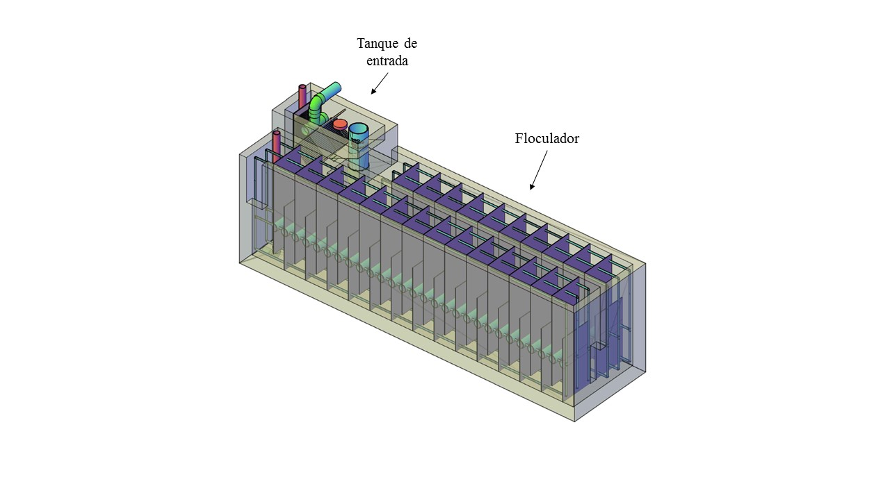
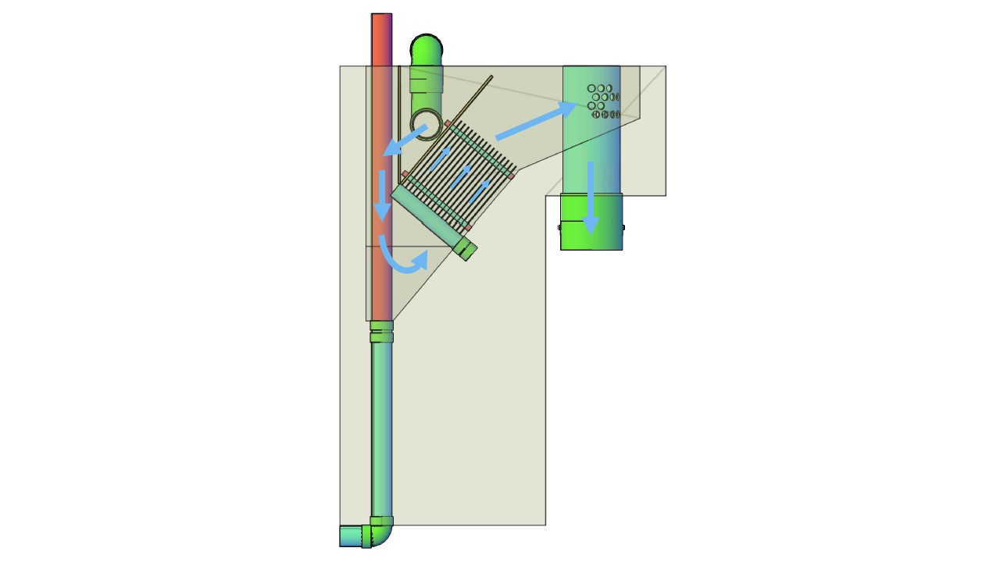

.. include:: ../global.rst

.. _title_Tanque_Propósito_y_Descripción:

***********************
Propósito y Descripción
***********************

.. _heading_funciones:

Funciones
---------
Las funciones principales del tanque de entrada son:

 #. Remover los sólidos gruesos del agua por sedimentación.
 #. Medir el caudal de agua para la dosificación de los químicos.
 #. Colar materiales gruesos tal como las hojas para que no se acumulen en el floculador.
 #. Proveer un espacio para la observación del agua cruda.

.. _heading_ubicación:

Ubicación
---------
El tanque de entrada está ubicado en la primera parte del primer canal del floculador (:numref:`figure_tank_and_flocculator`). Con los procesos integrados de esta forma se mantiene un diseño eficiente con respecto al área ocupada. Se diseñan el tanque de entrada y el floculador en conjunto para así optimizar el espacio necesario, minimizando el costo y cumpliendo con los requisitos operacionales (:ref:`title_Floc_Algoritmo_de_Diseño`).

.. _figure_tank_and_flocculator:

    El tanque de entrada está ubicado en la primera parte del primer canal del floculador.

.. _figure_transparent_tank:

.. figure:: Images/transparent_tank.png
    :width: 600px
    :align: center

    Vista isométrica del tanque de entrada con paredes transparentes.

.. _heading_flujo_de_agua:

Flujo de agua
-------------
Se coloca una te de PVC en cada tubo de entrada que dirige los chorros hacia las paredes laterales del tanque, así evitando las corrientes fuertes en la dirección de las placas de sedimentación. De la entrada el agua pasa por una rejilla que cuela los materiales gruesos tal como las hojas. Luego el flujo se da vuelta en la parte inferior del tanque para después subir, dividiéndose entre las |N.EtPlates| placas de sedimentación.

.. _figure_tank_front:

    Vista frontal del tanque de entrada con paredes transparentes. Las flechas azules demuestran la dirección del flujo de agua.

.. _heading_el_medidor_de_caudal_lineal:

El medidor de caudal lineal
---------------------------
El tanque de entrada también sirve para medir el caudal de agua en la planta. El Medidor de Caudal Lineal de Orificios (LFOM por sus siglas en inglés) es una serie de agujeros en el tubo de salida del tanque que crea una relación lineal entre el nivel de agua y el caudal. La altura del agua está conectada al sistema de dosificación de químicos a través de un flote para que el operador no tenga que cambiar el flujo de químicos cada vez que cambia el caudal en la planta. El LFOM está descrito en más detalle en la siguiente sección.
