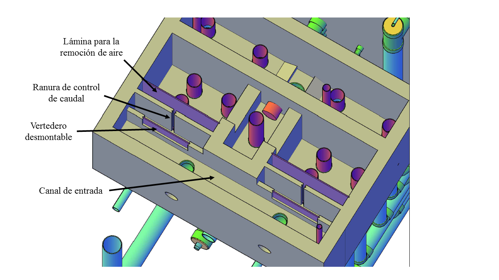
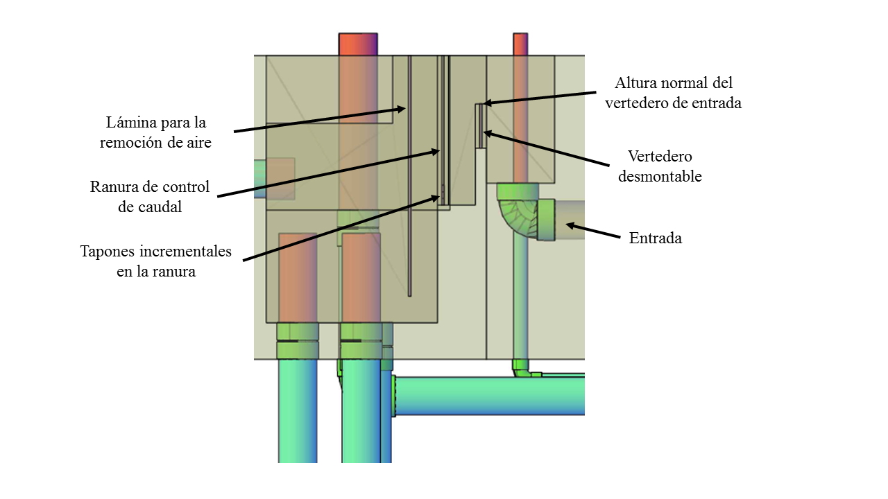

.. include:: ../global.rst

.. _title_Vertederos_de_Control_de_Caudal:

*******************************
Vertederos de Control de Caudal
*******************************

Durante el retrolavado del filtro, para fluidizar el lecho de arena entero y purgar el sedimento acumulado completamente, se necesita un caudal cerca del caudal de diseño. Un problema ocurre cuando se está operando la planta con un caudal menor, y por lo tanto cada filtro recibe solo una parte del caudal de diseño de |Q.Fi| cuando el agua se distribuye equitativamente. En las plantas que tienen más de un filtro, entre el canal de entrada y las cajas de entrada se puede instalar un sistema de vertederos que sirve para dirigir el caudal necesario al filtro que se está retrolavando (:numref:`figure_iso_enter_filter`).

.. _figure_iso_enter_filter:

    Vista isométrica de los vertederos de entrada al filtro.

Para iniciar el proceso de retrolavado se quita el vertedero desmontable sobre el cual se cae el agua del canal de entrada a la caja de entrada. La ranura detrás del vertedero hace que el nivel de agua en el canal de entrada suba al nivel de los vertederos de entrada de los otros filtros cuando está pasando el caudal deseado de |Q.Fi|. Si el caudal en la planta es mayor que |Q.Fi|, el nivel en el canal de entrada sube aún más y los otros filtros reciben la mayoría del caudal adicional. De esta manera el filtro que se está retrolavado recibe un caudal muy cerca del caudal de diseño independiente del caudal en la planta.

.. _figure_lat_enter_filter:

    Vista lateral de los vertederos de entrada al filtro.

Las dimensiones de la ranura de control de caudal se calculan para que, cuando se saca la compuerta desmontable para retrolavar ese filtro, el caudal entrando no sobrepase de |Pi.QFiBw| veces más que el caudal de diseño del filtro de |Q.Fi|. La altura es dado por:

.. math::
    :label: groove_height_calc

    H_{Ranura}=\frac{\left(\frac{3}{2}\frac{Q_{Planta}-\Pi_QQ_{Fi}}{\Pi_{VC}\sqrt{2g}\bullet W_{Dem \acute as}}\right)^{2/3}}{{\Pi_Q}^{2/3}-1}

| Donde
| :math:`Q_{Planta}` = el caudal de la planta = |Q.Plant|
| :math:`\Pi _Q` = el radio del caudal máximo admisible de retrolavado sobre el caudal del filtro = |Pi.QFiBw|
| :math:`Q _{Fi}` = el caudal del filtro = |Q.Fi|
| :math:`\Pi _{VC}` = el coeficiente de vena contracta para un orificio = |Pi.VCOrifice|
| :math:`W _{Dem \acute as}` = el ancho colectivo de los demás vertederos de entrada de los demás filtros

Con la altura, se puede calcular el ancho:

.. math::
    :label: goove_width_calc

    W_{Ranura}=\frac{3}{2}\frac{Q_{Fi}}{\Pi_{VC}\sqrt{2g}\bullet{H_{Ranura}}^{3/2}}

| Donde
| :math:`H_{Ranura}` = la altura de la ranura = |HL.FiBwFlowControlSlot|

Al fondo de la ranura se colocan algunos tapones incrementales para calibrar y controlar finamente el caudal que entrará al filtro durante el retrolavado. La altura de estos tapones se define para poder ajustar el caudal de entrada en incrementos de aproximadamente 10% (redondeada al centímetro):

.. math::
    :label: plug_height_calc

    H_{Tap \acute on}=\left(\frac{3}{2}\frac{{1.1\bullet Q}_{Fi}}{\Pi_{VC}\sqrt{2g}\bullet W_{Ranura}}\right)^{2/3}-H_{Ranura}

| Donde
| :math:`H_C` = la altura de la compuerta = |H.FiStopGate|
| :math:`{HL}_C` = la pérdida de carga permitida por la compuerta (modelada como orificio) = |HL.FiOpenWeirMax|

.. _table_FRAMCA_input_data:

.. csv-table:: Datos del sistema de vertederos de entrada del FRAMCA
    :align: center

    Altura de la compuerta en el primer vertedero, |H.FiStopGate|
    Ancho de la compuerta en el primer vertedero, |W.FiStopGate|
    Radio del caudal máximo (que entra cuando la planta está tratando el caudal máximo de diseño) al caudal deseado de retrolavado de |Q.Fi|, |Pi.QFiBw|
    Ancho de la ranura en el segundo vertedero, |W.FiBwFlowControl|
    Altura total de la ranura en el segundo vertedero, |H.FiFlowControlSlotTotal|
    Altura de cada tapón incremental de la ranura, |H.FiSlotStopper|
    Número de tapones incrementales de la ranura, |N.FiSlotStopper|
    Caudal adicional estimado que corresponde a cada tapón incremental, |Q.FiSlotStopperIncrement|
